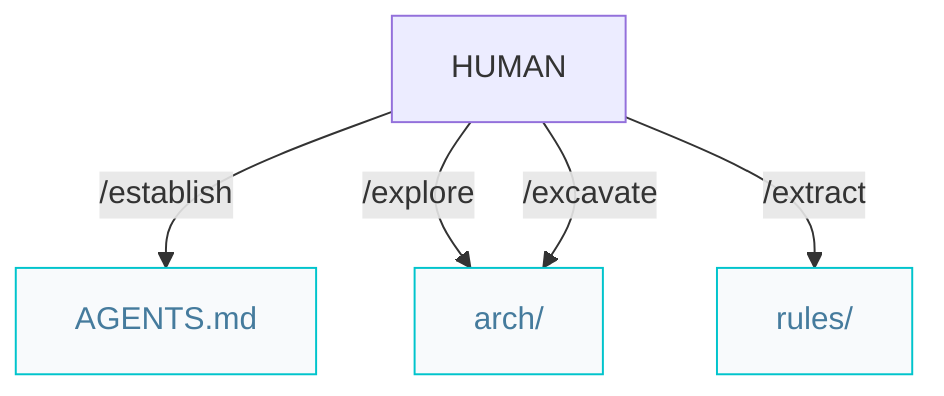

# Architect pipelines

Paths below are under `{Product_Folder}` (default `.product/`).

## Architecture pipeline (greenfield or brownfield)



### Workflow

```markdown
/establish -> /explore -> /excavate -> /extract
```

The same four steps apply to every project. Each is **mode-aware**: it prescribes on greenfield (no source code) and describes from the codebase on brownfield.

- `/explore` writes `system.arch.md` and `ADR.md`.
- `/excavate` produces one tier per invocation: `{tier}.arch.md`. When every tier is done, it writes `ER.md`.
- `/extract` produces `{tier}.rules.md` per tier. When the rules are complete, start features with `/specify`.