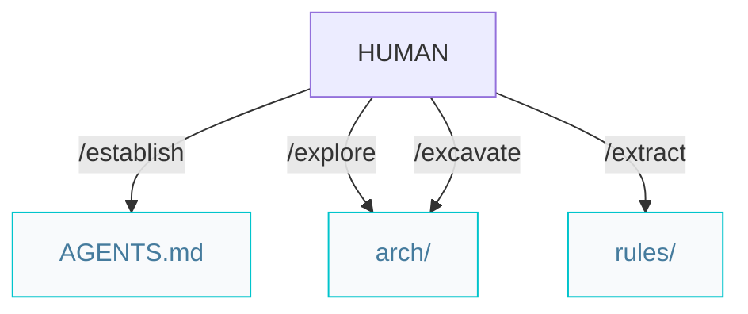
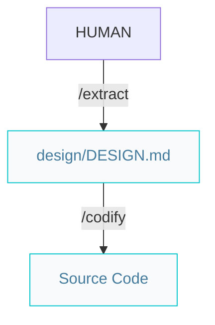

# Architect pipelines

Paths below are under `{Product_Folder}` (default `.product/`).

## Architecture pipeline (greenfield or brownfield)



### Workflow

```markdown
/establish -> /explore -> /excavate -> /extract
```

The same four steps apply to every project. Each is **mode-aware**: it prescribes on greenfield (no source code) and describes from the codebase on brownfield.

- `/explore` writes `system.arch.md` and `ADR.md`.
- `/excavate` produces one tier per invocation: `{tier}.arch.md`. When every tier is done, it writes `ER.md`.
- `/extract` produces `{tier}.rules.md` per tier. For presentation tiers it also writes `design/DESIGN.md` (design tokens + component behavior). When the rules are complete, start features with `/specify`.

## UI from design spec

Paths below are under `{Product_Folder}` (default `.product/`).

The product UI design spec is **not** a separate skill: `/extract` authors `design/DESIGN.md` when it processes a presentation tier (greenfield prescribes tokens from the brand; brownfield infers them from existing theme/CSS). `/codify` then implements every UI surface from `DESIGN.md` plus the tier rules.



Format reference: [DESIGN.md template](../.agents/skills/extract/design.template.md). Skill: [`/extract`](../.agents/skills/extract/SKILL.md).

Per-feature UI behavior beyond the global design system belongs in that feature's spec (`/specify`) as UI acceptance criteria, not in a separate design file. After UI is built, run `/review` (a11y, security, performance — fixed in the same pass); optionally `/refactor` for clean-code passes.