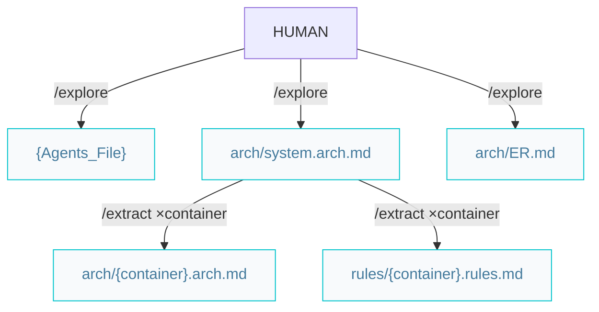

# Architect pipelines

Paths below are under `{Product_Folder}` (e.g. `docs/` or `.product/`) and `{Agents_Folder}` (e.g. `.agents/`), as declared in the root `{Agents_File}`.

## Architecture pipeline (greenfield or brownfield)



### Workflow

```markdown
/explore -> /extract (×container)
```

Both steps are **mode-aware**: they prescribe on greenfield (no source code) and extract from the codebase on brownfield. `/extract` resolves the mode per container — a brownfield repo can still have a greenfield container.

- `/explore` sets up AIDD and documents the system (C4 L2):
  - Root `{Agents_File}` (`AGENTS.md` | `CLAUDE.md`) — environment, paths, git rules, status chain, product brief.
  - `arch/system.arch.md` — containers diagram with per-container details.
  - `arch/ER.md` — the domain Entity-Relationship diagram (kept separate as it grows large).
- `/extract` documents **one container per invocation** (C4 L3):
  - `arch/{container}.arch.md` — components diagram, code organization, contract surface.
  - `arch/db.schema.md` / `arch/api.schema.md` — system-wide field-level database/API schema, kept separate as they grow large; written when the owning container is extracted (when applicable).
  - `{Agents_Folder}/rules/{container}.rules.md` — naming, conventions, one canonical example.

When every container is documented, start features with `/specify`.
