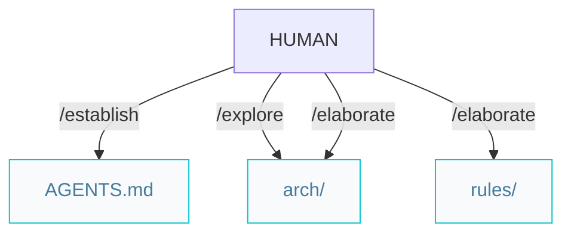
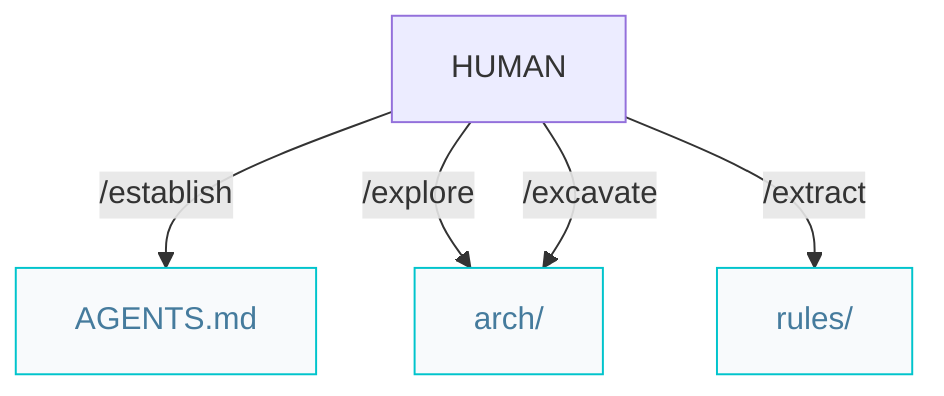

# Architect pipelines

Paths below are under `{Product_Folder}` (default `.product/`).

## Greenfield projects from scratch


### Workflow

```markdown
/establish -> /explore -> /elaborate
```

`/elaborate` prescribes one tier per invocation: `{tier}.arch.md` and `{tier}.rules.md`. When every tier is done, it writes `ER.md`, then you can start features with `/specify`.

## Brownfield projects with legacy code



### Workflow

```markdown
/establish -> /explore -> /excavate -> /extract
```