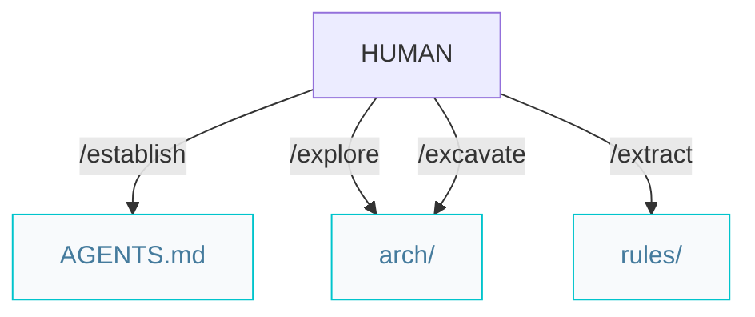
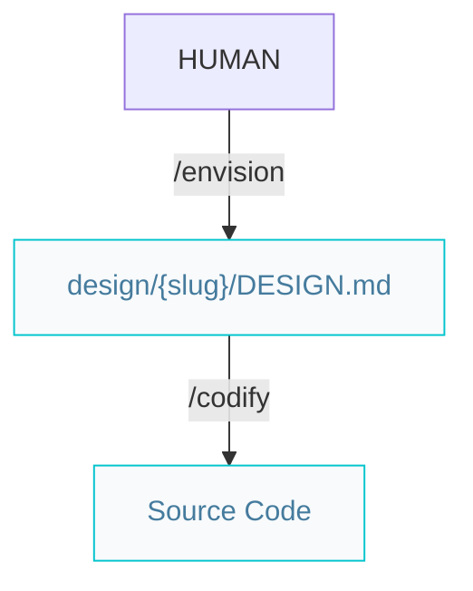
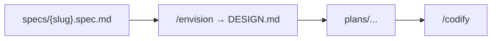

# Architect pipelines

Paths below are under `{Product_Folder}` (default `.product/`).

## Architecture pipeline (greenfield or brownfield)



### Workflow

```markdown
/establish -> /explore -> /excavate -> /extract
```

The same four steps apply to every project. Each is **mode-aware**: it prescribes on greenfield (no source code) and describes from the codebase on brownfield.

- `/explore` writes `system.arch.md` and `ADR.md`.
- `/excavate` produces one tier per invocation: `{tier}.arch.md`. When every tier is done, it writes `ER.md`.
- `/extract` produces `{tier}.rules.md` per tier. When the rules are complete, start features with `/specify`.

## UI from design spec

Paths below are under `{Product_Folder}` (default `.product/`).

### Standalone UI



`/envision` authors the design spec at `design/{slug}/DESIGN.md` (tokens + component behavior); `/codify` then implements the UI from it. Use existing `feat/{slug}` or create it before UI commits (same as `/codify`). Format reference: [DESIGN.md](../.agents/skills/envision/DESIGN.md). Skill: [`/envision`](../.agents/skills/envision/SKILL.md).

### Optional: spec-driven UI work

For design systems that are part of a product feature, slot `/envision` between the spec and the build:



Then `/review` on the implementation (a11y, security, performance — findings are fixed in the same pass); optionally `/refactor` for clean-code passes.