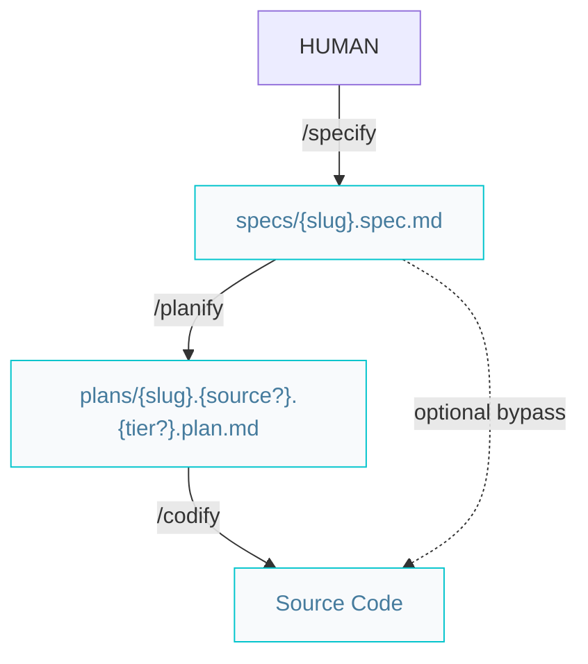
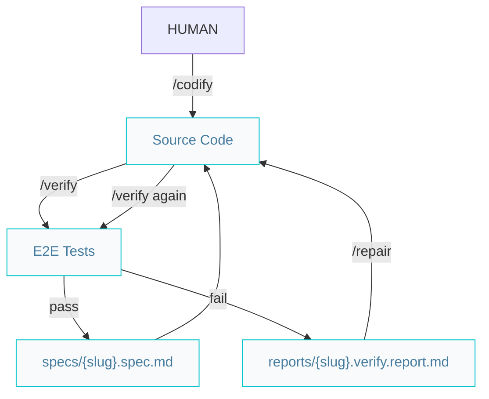

# Builder pipelines

Paths below are under `{Product_Folder}` (default `.product/`).

## Build features or complex improvements

- `/planify` is recommended for non-trivial work; `/codify` may start from a spec when the user explicitly skips planning (see spec status in project `AGENTS.md` and `/codify` skill).
- Fullstack plans: `plans/{slug}.spec.plan.md` (no tier segment).
- Each step commits via [`/repository`](/.agents/skills/repository/). `/codify` creates `feat/{slug}` before writing code.

## Verify features or complex improvements

On E2E failure, `/verify` writes `reports/{slug}.verify.report.md` with acceptance-criterion traceability. Use `/repair`, then re-run `/verify`. Spec stays `in-progress` until tests pass.

`/verify` and `/repair` stay on the same `feat/{slug}` branch as `/codify`.
