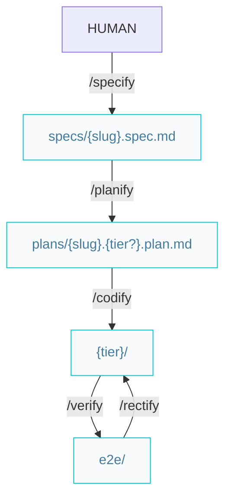

# Builder pipelines

Paths below are under `{Product_Folder}` (default `.product/`).

## Build features or complex improvements



### Workflow

#### On success

```markdown
/specify -> /planify -> /codify -> /verify
```

#### On failed

```markdown
/specify -> /planify -> /codify -> /verify -> /rectify -> /verify
```

