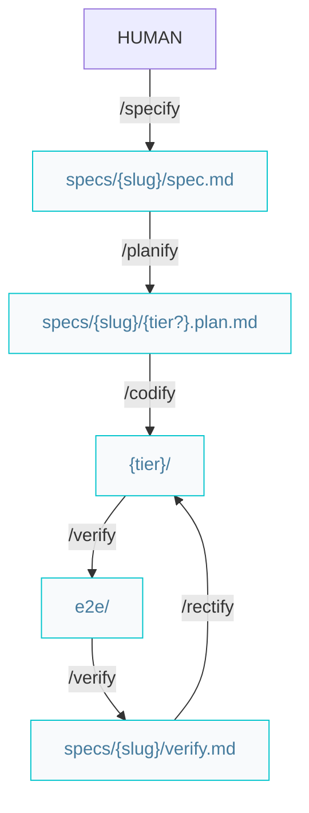

# Builder pipelines

Paths below are under `{Product_Folder}` (default `.product/`).

## Build features or complex improvements

All feature artifacts live together in `specs/{slug}/` (`spec.md`, `{tier?}.plan.md`, `verify.md`). E2E test code stays in the solution (`e2e/`).



### Workflow

#### On success

```markdown
/specify -> /planify -> /codify -> /verify
```

#### On failed

```markdown
/specify -> /planify -> /codify -> /verify -> /rectify -> /verify
```

