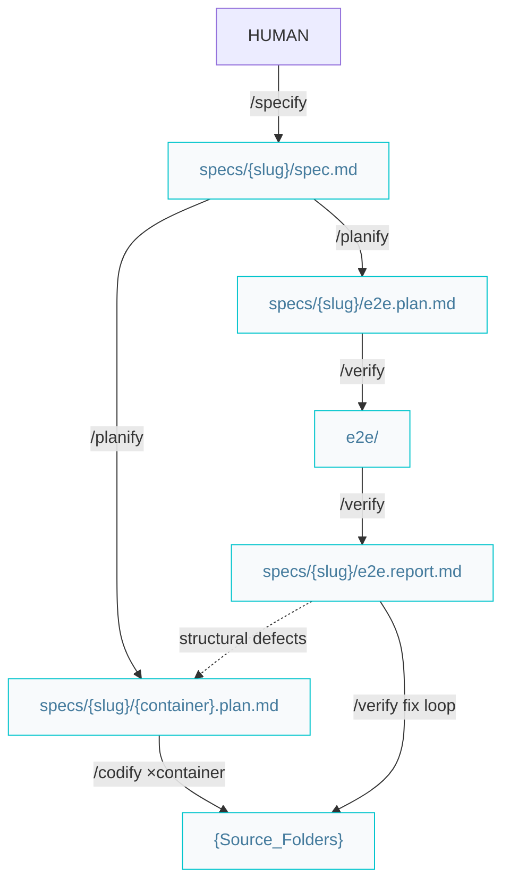

# Builder pipelines

Paths below are under `{Product_Folder}` (e.g. `docs/` or `.product/`), as declared in the root `{Agents_File}`.

## Build features or complex improvements

All feature artifacts live together in `specs/{slug}/` (`spec.md`, `{container}.plan.md`, `e2e.plan.md`, `e2e.report.md`). E2E test code stays in the solution (`e2e/`).



### Workflow

```markdown
/specify -> /planify -> /codify (×container) -> /verify
```

Division of labor:

- `/specify` — the **what**: problem, per-container expected results, acceptance criteria. No technical detail.
- `/planify` — the **how**: one plan per affected container plus one transversal `e2e.plan.md`. Shared contracts (API shapes, schemas) are stated verbatim in every sibling plan.
- `/codify` — one container plan per run; sessions can run in parallel. Functional code + unit tests. If an in-scope change would alter a shared contract, it hands back to `/planify` — never improvises a cross-container change. Never touches the `e2e` container.
- `/verify` — owns the `e2e` container: writes and runs the tests, writes `e2e.report.md`, marks the spec's acceptance criteria `[x]/[ ]`, then **fixes defects in a loop** until green. Implementation and verification never share a session.

#### When the suite is not green

`/verify` triages each defect by kind:

```markdown
code bug | test bug  -> /verify fixes in place and re-runs (resume with the e2e.report.md)
structural           -> escalate: /planify the e2e.report.md -> /codify -> /verify
```

Once green, continue with `/review` and `/release`.
