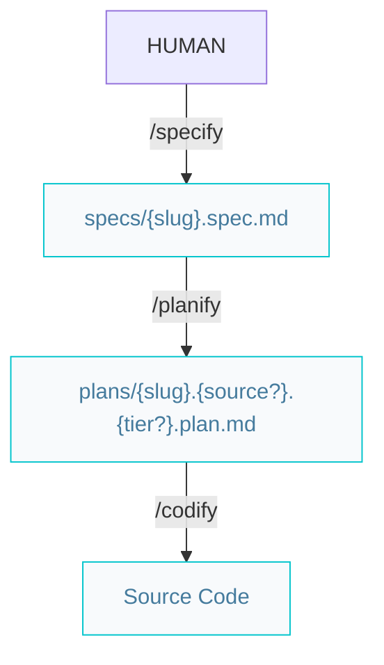
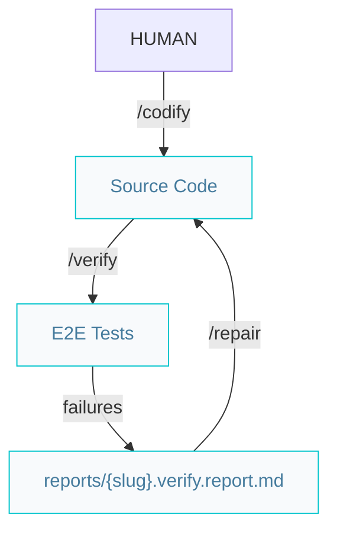

# Builder pipelines

Paths below are under `{Product_Folder}` (default `.product/`).

## Build features or complex improvements

## Verify features or complex improvements

On E2E failure, `/verify` writes `reports/{slug}.verify.report.md`. Use `/repair` to fix findings, then re-run `/verify`.

