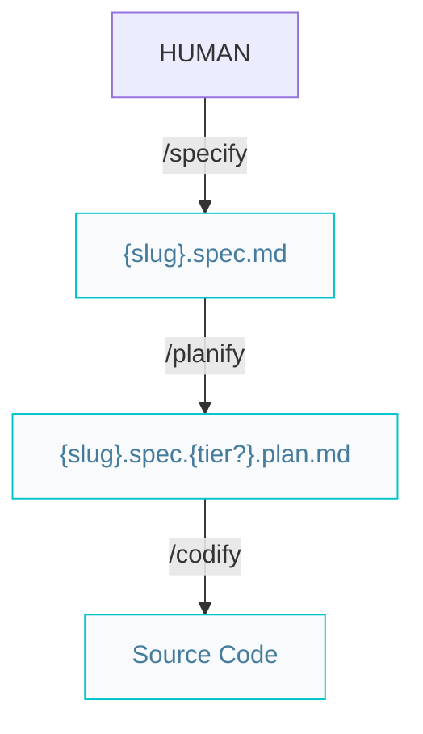
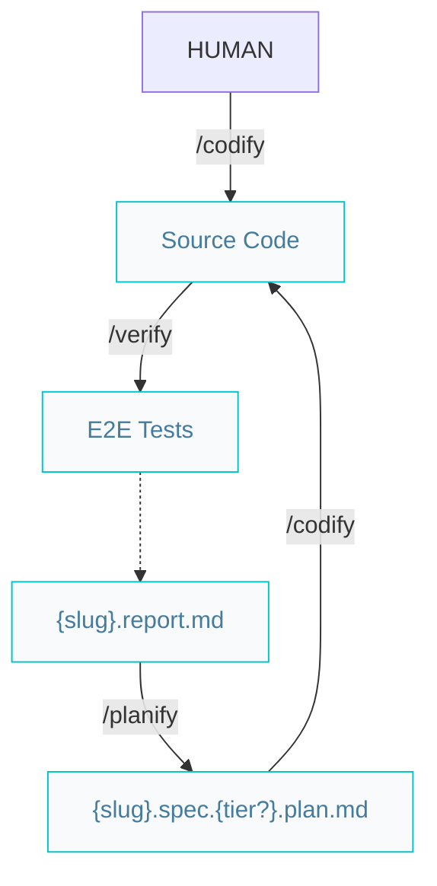

# Builder pipelines

## Build features or complex improvements

```mermaid
flowchart TD  
  HUM[HUMAN]
  SPC["{slug}.spec.md"]:::nd
  PLN["{slug}.spec.{tier?}.plan.md"]:::nd
  COD[Source Code]:::nd

  HUM -->|/specify| SPC
  SPC -->|/planify| PLN
  PLN -->|/codify| COD

  classDef nd fill:#f8fafc,stroke:#00c4cc,color:#457b9d
```

## Verify features or complex improvements

```mermaid
flowchart TD    
  HUM[HUMAN]
  COD[Source Code]:::nd
  E2E["E2E Tests"]:::nd
  PLN["{slug}.spec.{tier?}.plan.md"]:::nd
  RPT["{slug}.report.md"]:::nd

  HUM -->|/codify| COD
  COD -->|/verify| E2E
  E2E -.-> RPT
  RPT -->|/planify| PLN
  PLN -->|/codify| COD

  classDef nd fill:#f8fafc,stroke:#00c4cc,color:#457b9d
```
