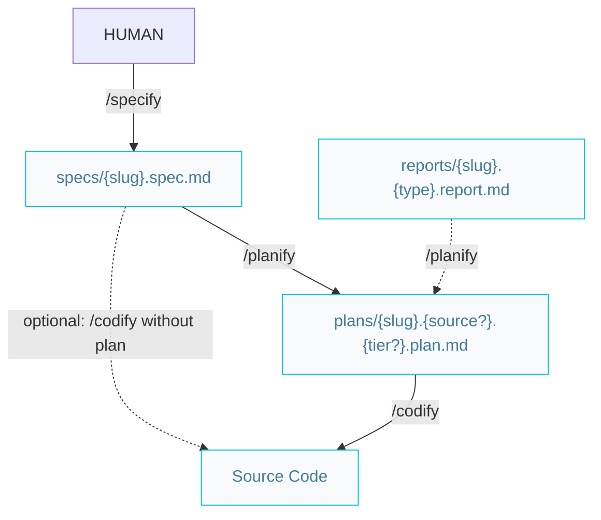
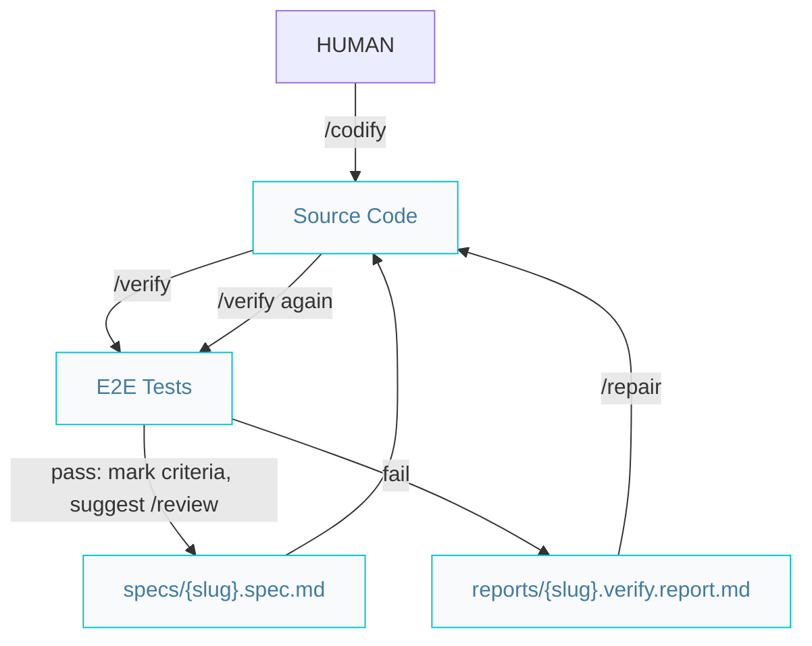

# Builder pipelines

Paths below are under `{Product_Folder}` (default `.product/`).

## Build features or complex improvements

- `/planify` is recommended for non-trivial work; `/codify` may start from a spec or requirement when planning is skipped ([codify skill](../.agents/skills/codify/SKILL.md)).
- Fullstack plans: `plans/{slug}.spec.plan.md` (no tier segment).
- **Plan status:** `pending` (from `/planify`) → `in-progress` (start of `/codify`) → `done` (end of `/codify`).
- **Spec status during build:** `pending` (from `/specify`) → `in-progress` (start of `/codify`; stays until `/release`).
- Git per step: project `AGENTS.md` and [`/repository`](../.agents/skills/repository/SKILL.md) (`feat/{slug}` before `/codify` implementation).

## Verify features or complex improvements

On E2E failure, `/verify` writes `reports/{slug}.verify.report.md`. Use `/repair`, then re-run `/verify`. On pass, `/verify` marks acceptance criteria `[x]` in the spec and suggests `/review`. Spec stays `in-progress` until `/release` sets `done`.

During a feature cycle, `/verify` and `/repair` use the same branch as `/codify` (see [repository skill](../.agents/skills/repository/SKILL.md)).
