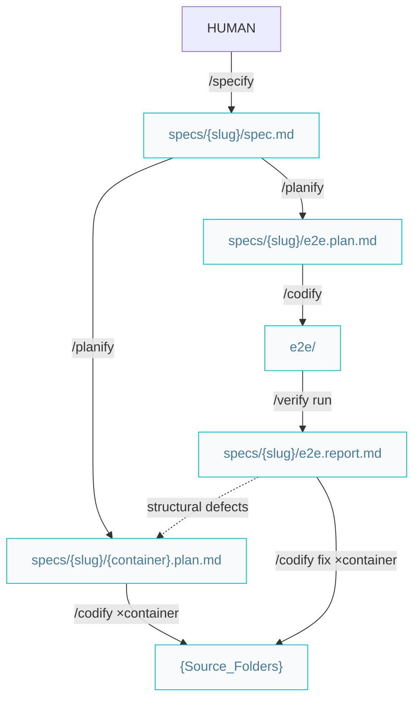

# Builder pipelines

Paths below are under `{Product_Folder}` (e.g. `docs/` or `.product/`), as declared in the root `{Agents_File}`.

## Build features or complex improvements

All feature artifacts live together in `specs/{slug}/` (`spec.md`, `{container}.plan.md`, `e2e.plan.md`, `e2e.report.md`). E2E test code stays in the solution (`e2e/`).



### Workflow

```markdown
/specify -> /planify -> /codify (×container) -> /verify
```

Division of labor:

- `/specify` — the **what**: problem, per-container expected results, acceptance criteria. No technical detail.
- `/planify` — the **how**: one plan per affected container, the transversal `e2e.plan.md` included (one scenario step per acceptance criterion). Shared contracts (API shapes, schemas) are stated verbatim in every sibling plan.
- `/codify` — one container plan per run; sessions can run in parallel. Functional code + unit tests — and the e2e suite, implemented from `e2e.plan.md` like any plan (done when it executes; red against unverified features is expected). If an in-scope change would alter a shared contract, it hands back to `/planify` — never improvises a cross-container change.
- `/verify` — **report-only**: runs the e2e suite, writes `e2e.report.md` with a kind and handoff per defect, and marks the spec's acceptance criteria `[x]/[ ]`. It never edits code, tests, or plans — implementation and evaluation never share a session.

#### When the suite is not green

`/verify` triages each defect by kind; the handoff routes the fix:

```markdown
code bug | test bug  -> /codify the e2e.report.md (×affected container) -> /verify re-runs
structural           -> escalate: /planify the e2e.report.md -> /codify -> /verify
```

Once green, continue with `/review` and `/release`.
