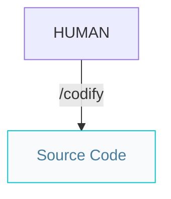
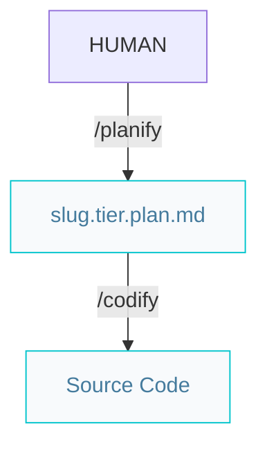
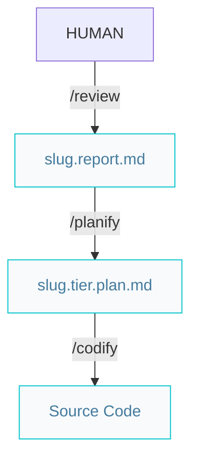
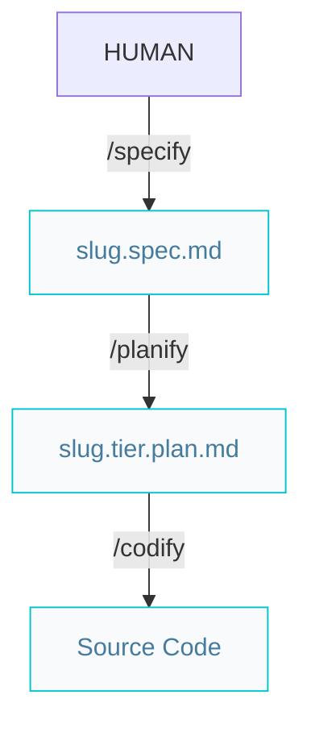

# Codify workflows

## Minor bug fixes or improvements

## Simple bug fixes or improvements

## Review reports 

## New features or complex improvements

# Plan naming conventions
- `spec-{slug}.spec.md` → from specification
- `spec-{slug}.{tier}.plan.md` → plan from specification for a specific tier
- `fix-{slug}.{tier}.plan.md` → plan from bug/simple improvement
- `review-{slug}.{tier}.plan.md` → plan from review report

ArtefactoPatrónSpec{slug}.spec.mdReport{slug}.report.mdPlan (tiered){slug}.{source}.{tier}.plan.mdPlan (fullstack){slug}.{source}.plan.md
Ejemplos concretos:

user-auth.spec.md → user-auth.spec.back.plan.md + user-auth.spec.front.plan.md
login-crash.report.md → login-crash.report.back.plan.md
add-dark-mode.requirement.plan.md (fullstack, sin tier)