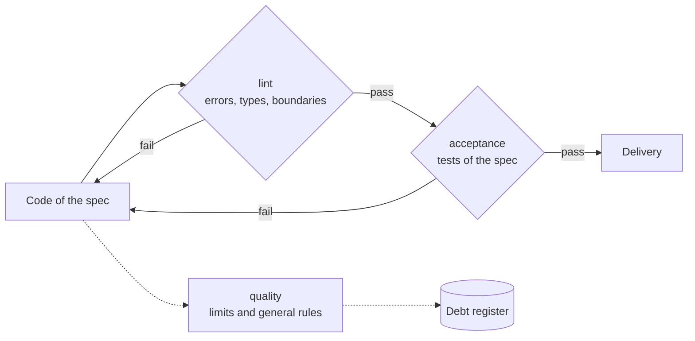
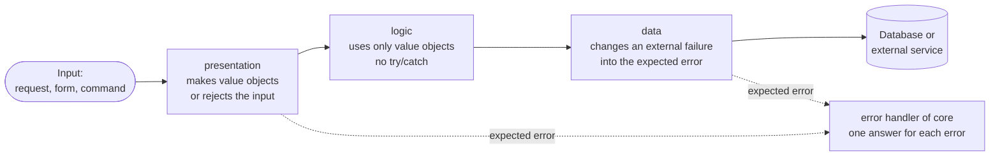

# Coding Rules and Limits

This document gives the rules for the code of each new project: what blocks a delivery, the limits and the general rules. For the parts of a project, the boundary rules and the file names, see [`architect-system-foundation.md`](./architect-system-foundation.md).

> **Sources.** The foundation copies these rules into the `AGENTS.md` of each project. If you change a rule here, change it in its source file too, with `/maintain-skills`.
>
> - Rules and limits: [`project.AGENTS.template.md`](../.agents/skills/architect-system-foundation/assets/project.AGENTS.template.md), section 6.
> - JS / TS limits: [`oxlint.complexity.json`](../.agents/skills/architect-system-foundation/assets/oxlint.complexity.json).
> - Folder entries: the `quality` run of the core, [`work.mjs`](../.agents/aidd/commands/work.mjs).

## Contents

- [What blocks a delivery](#what-blocks-a-delivery)
- [Limits](#limits)
- [General rules](#general-rules)

## What blocks a delivery

First make it work. Then make it correct. Only `lint` and `acceptance` block a delivery. The findings of `quality` go to the debt register, and a later pass repairs them.

| Check | Slot | Blocks the delivery |
| --- | --- | --- |
| Errors, types and boundary rules | `lint` | Yes |
| Acceptance tests of the spec | `acceptance` | Yes |
| Unit tests | `unit` | No |
| Limits and general rules | `quality` and the review | No. A violation is debt. |
| Format | `format` | No. It runs before integration and changes the files. |

## Limits

The archetype can change these numbers.

| Limit | Code | Tests | Measured by |
| --- | --- | --- | --- |
| Cyclomatic complexity of a function | 8 | 8 | `eslint/complexity` |
| Statements in a function | 16 | 64 | `eslint/max-statements` |
| Nesting depth | 2 | 4 | `eslint/max-depth` |
| Parameters of a function | 3 | 4 | `eslint/max-params` |
| Lines in a file | 128 | 256 | `eslint/max-lines` |
| Entries in a folder of `shared` or of a feature | 16 | — | the `quality` run of the core |

- The line counts of a file do not include blank lines and comments.
- **Tests** are the files `*.test.ts` and `*.spec.ts`. In an `e2e` project, all files use the test limits.
- **Statements, not lines, for a function.** A nested function has its own count. Thus a suite counts each test as one statement, and a long data value (an object, a template) is one statement.
- **A full folder.** Divide a full `shared` folder by topic. Divide a full feature into two features. Never add subfolders in a feature (see [Inside a feature](./architect-system-foundation.md#inside-a-feature)).

## General rules

These rules apply to all technologies. A violation is debt. It does not block the delivery.

### Names and types

- Use names that are idiomatic for the language. Use the words of the domain.
- Give each domain concept its own type. Do not use a bare `string` or `number` for it (no primitive obsession).
- A value with rules (an email, an amount, an identifier) is a **value object**. It cannot change. It checks its value when it is created. Two value objects with the same value are equal.
- A value object checks only the rules that the spec states.
- Put a generic value object in `shared`. Put a value object with domain words in the types of its feature.

### Edges

The input enters at an edge. Make the value objects and catch the errors only at the edges. Inside, the code trusts its types.

- Catch errors only at the edges: the error handler of `core`, and the `data` layer when it changes an external failure into the expected error.
- A function with `try`/`catch` contains only the `try`/`catch`. The `try` block calls a different function that does the work.
- Do not hide errors. Use one method only to handle errors in the project.
- Do not add a check, a limit or a default value that the spec does not state.

### Functions

- Use early returns. Check the incorrect cases first, and return or raise an error. Then the main path has no `else` and no nesting.
- If a block is longer than a few lines or nests more than the limit, move it to a function. Give the function a name from the domain.
- If a condition has more than one logical operator, move it to a predicate. Give the predicate a name from the domain.
- If a function needs more than three values, give it one typed object.
- Before you write a check or a conversion, look for it in the shared primitives.

### Data, configuration and dependencies

- If the store has a query language (such as SQL), write each statement as a named constant at the top of the `data` file that uses it. Never write a statement in a function or in a different layer. Never share a statement between features.
- Keep the schema definition (tables and migrations) in numbered files with the extension of that language (such as `.sql`), in one location. These are the only statement files.
- Tests can write statements in code.
- Get configuration from the environment. Do not put configuration values in the code.
- Anchor the ignore patterns for runtime data to the project root (`/data/`, not `data/`). Then they cannot hide a `data` layer folder.
- Add a dependency only with the add command of the package manager. That command gets the latest release. Do not write a version by hand or from memory.
