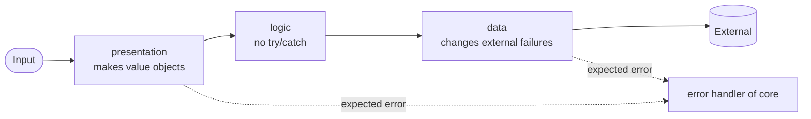

# Coding Rules and Limits

This document gives the rules for the code of each new project: what blocks a delivery, the limits, and the general rules. See [`architect-system-foundation.md`](./architect-system-foundation.md) for the parts of a project and the dependencies.

> **Sources.** If you change a rule here, also change its source file. Use `/maintain-skills`. The source files are:
>
> - The Blueprint section of [`AGENTS.template.md`](../.agents/skills/outline-system/assets/AGENTS.template.md).
> - [`oxlint.complexity.json`](../.agents/skills/architect-system-foundation/assets/oxlint.complexity.json) for the JS / TS limits.
> - [`work.mjs`](../.agents/aidd/commands/work.mjs) for the folder entries.

## What blocks a delivery

First make it work. Then make it correct.

| Check | Slot | Blocks the delivery |
| --- | --- | --- |
| Errors, types and imports | `lint` | Yes |
| Acceptance tests of the spec | `acceptance` | Yes |
| Unit tests | `unit` | No |
| Limits and general rules | `quality` and the review | No. A violation is debt. |
| Format | `format` | No. It runs before integration. |

The findings of `quality` go to the debt register. A later pass repairs them.

## Limits

The archetype can change these numbers in the technology rules of its `AGENTS.md`.

| Limit | Code | Tests | Measured by |
| --- | --- | --- | --- |
| Cyclomatic complexity of a function | 8 | 8 | `eslint/complexity` |
| Statements in a function | 16 | 64 | `eslint/max-statements` |
| Nesting depth | 2 | 4 | `eslint/max-depth` |
| Parameters of a function | 3 | 4 | `eslint/max-params` |
| Lines in a file | 128 | 256 | `eslint/max-lines` |
| Entries in a folder of `shared` or of a feature | 16 | — | the `quality` run of the core |

- Tests are the `*.test.ts` and `*.spec.ts` files. In an `e2e` project, all files use the test limits.
- Blank lines and comments do not count as lines.
- A nested function has its own statement count. Thus a long data value is one statement.
- A callback with a signature that the framework sets is outside the parameter limit.
- Divide a full `shared` folder by technical concern. Divide a full feature into two features.

## General rules

These rules apply to all technologies. A violation is debt.

### Names and types

- Use names that are idiomatic for the language. Use the words of the domain.
- Give each domain concept its own type. Do not use a bare `string` or `number` for it.
- A value with rules is a **value object**: an email, an amount, an identifier. It cannot change. It checks its value when you make it. Two value objects with the same value are equal.
- A value object checks only the rules that the spec states.
- Put a generic value object in `shared`. Put a value object with domain words in the types of its feature.

### Edges

The input enters at an edge. Make the value objects and catch the errors only at the edges. Inside, the code trusts its types.

- Catch errors only in the error handler of `core`, and in `data` to change an external failure into the expected error.
- A function with `try`/`catch` contains only the `try`/`catch`. The `try` block calls a different function.
- Do not hide errors. Use one method to handle errors in the project.
- Do not add a check, a limit or a default value that the spec does not state.

### Functions

- Use early returns. Check the incorrect cases first. Then the main path has no `else`.
- Move a long or deep block to a function. Give the function a name from the domain.
- Move a condition with more than one logical operator to a predicate. Give the predicate a name from the domain.
- If a function needs more than three values, give it one typed object.
- Before you write a check or a conversion, look for it in the shared primitives.

### Data, configuration and dependencies

- Write each query statement (such as SQL) as a named constant. Put it at the top of the `data` file that uses it. Do not share a statement between features. Tests can write statements in code.
- Keep the schema and the migrations in numbered files (such as `.sql`) in one location.
- Get the configuration from the environment. Do not put configuration values in the code.
- Anchor the ignore patterns for runtime data to the project root: `/data/`, not `data/`. Then they cannot hide a `data` folder.
- Add a dependency only with the add command of the package manager. Do not write a version by hand.
