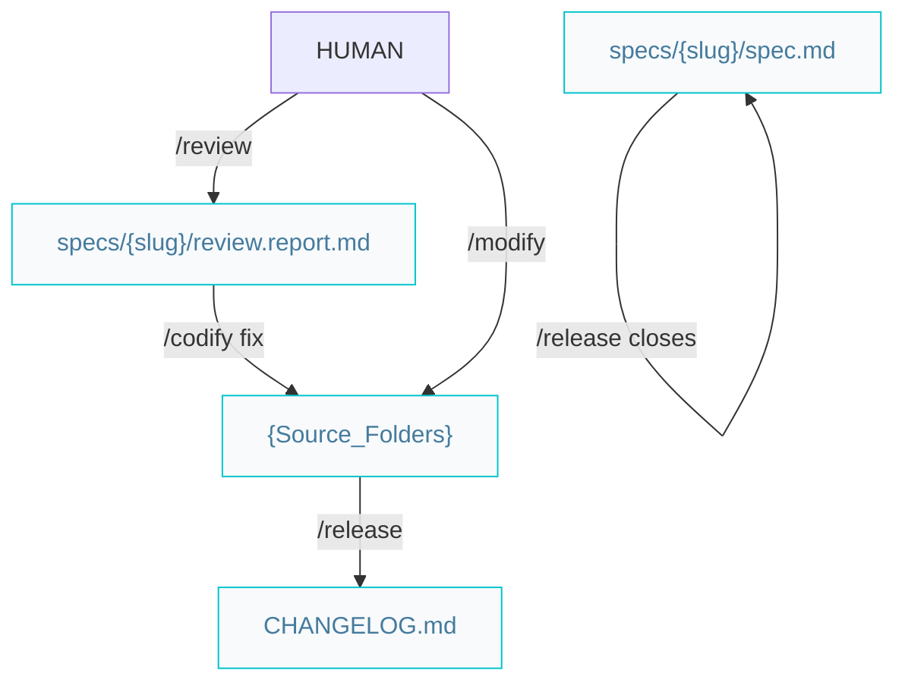

# Craftsman pipelines

Paths below are under `{Product_Folder}` (e.g. `docs/` or `.product/`), as declared in the root `{Agents_File}`.

## Quality and release



### `/review` — scope-bound quality

Audits a code scope (feature branch, plan/spec files, or explicit paths) for **a11y, security, performance, and clean-code/DRY**, and writes `review.report.md` — each finding with a dimension, severity, kind, and handoff. Report-only by default: fixes land via `/codify` with the report; an explicit `--fix` applies the mechanical findings (renames, dead code, extractions) directly. It never changes spec or plan status.

Guardrails worth knowing:

- **Green baseline gate** — it refuses to start on a failing suite; run `/verify` first.
- **Behavior findings are not its call** — a finding whose fix would change observable behavior is handed to `/modify`.
- **Contracts are frozen** — restructuring shared API shapes, schemas, or component boundaries is a structural refactor: handed to `/planify`.

### `/release` — close the loop

Bumps the version (SemVer), moves `Unreleased` changelog entries under the new version (Keep a Changelog), updates human docs, and **reconciles the architecture docs** against what shipped. For features it closes the spec (`status: done`, `released-version`) and stamps `superseded-by:` on amended specs. It also ships spec-less maintenance patches (defect fixes, structural refactors).

### `/modify` — maintenance entry point

Changes to **released** features start here. One triage question — *does the current code pass the released acceptance criteria?*

| Answer | It is a... | Route |
|---|---|---|
| Code violates a criterion | implementation defect | direct fix + regression e2e test → patch `/release` |
| Code matches the criteria | requirement change | `/specify` with `amends: {old-slug}` → full pipeline → `/release` |

### Workflow

```markdown
/verify (green) -> /review -> /codify fixes (or --fix) -> /verify -> /release
```

Maintenance:

```markdown
/modify -> fix -> /release           (defect)
/modify -> /specify -> ... -> /release   (requirement change)
```
