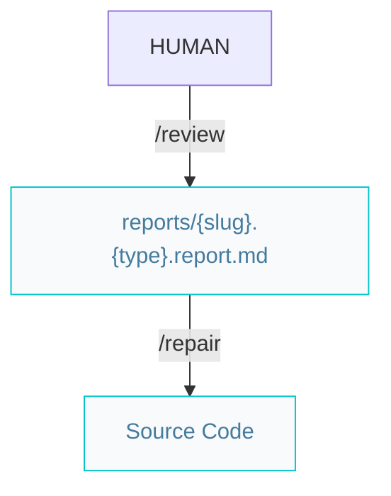
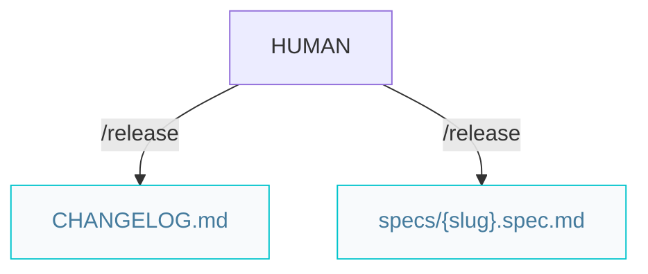

# Craftsman pipelines

Paths below are under `{Product_Folder}` (default `.product/`).

## Repair

Use `/repair` for findings from `/review` or `/verify` reports.

```mermaid
flowchart TD  
  HUM[HUMAN]
  RPT["reports/{slug}.{type}.report.md"]:::nd
  COD[Source Code]:::nd

  HUM -->|/review| RPT
  RPT -->|/repair| COD
 
  classDef nd fill:#f8fafc,stroke:#00c4cc,color:#457b9d
```

## Release 

```mermaid
flowchart TD  
  HUM[HUMAN]
  SPC["specs/{slug}.spec.md"]:::nd
  CHL["CHANGELOG.md"]:::nd

  HUM -->|/release| CHL & SPC
  
  classDef nd fill:#f8fafc,stroke:#00c4cc,color:#457b9d
``` 
