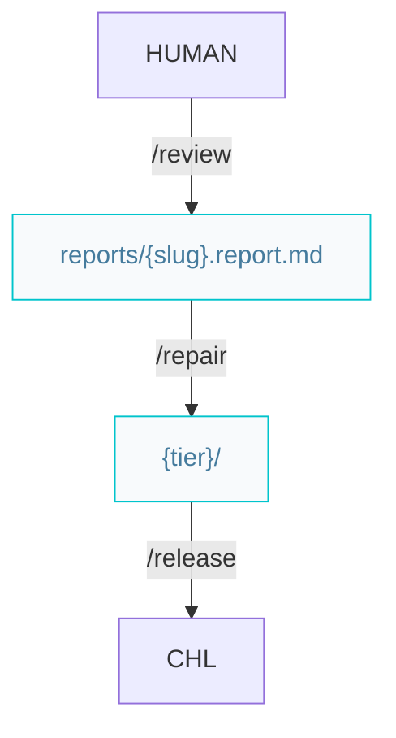

# Craftsman pipelines

Paths below are under `{Product_Folder}` (default `.product/`).

## Build features or complex improvements



### Workflow

#### On success

```markdown
/review -> /release
```

#### On failed

```markdown
/review -> /repair -> /release
```

