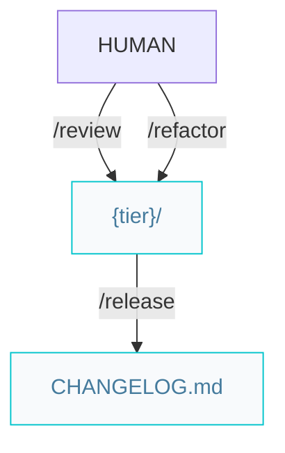

# Craftsman pipelines

Paths below are under `{Product_Folder}` (default `.product/`).

## Quality and release



Both **`/review`** and **`/refactor`** edit code in place, then commit one detailed conventional message; run unit and E2E tests (or **`/verify`**) afterward.

### Workflow

```markdown
/review -> /release
```

Optional (clean code / DRY):

```markdown
/refactor -> (tests) -> /release
```
