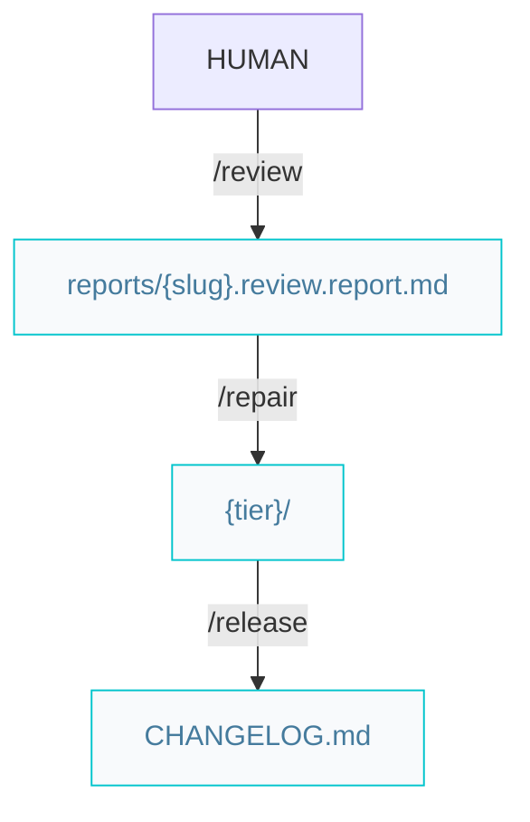

# Craftsman pipelines

Paths below are under `{Product_Folder}` (default `.product/`).

## Build features or complex improvements



Hygiene without a review report: **`/refactor`** edits code in place, then uses **`/repository`** for one detailed conventional commit; run unit and E2E tests (or **`/verify`**) afterward.

### Workflow

#### On success

```markdown
/review -> /release
```

#### On failed

```markdown
/review -> /repair -> /release
```

Optional (clean code / DRY, no `{slug}.review.report.md`):

```markdown
/refactor -> (tests) -> /release
```

