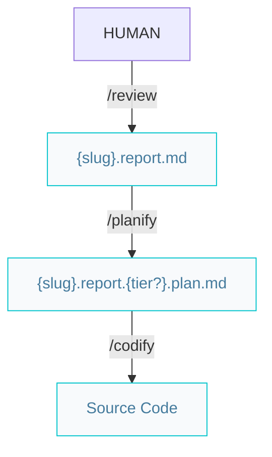
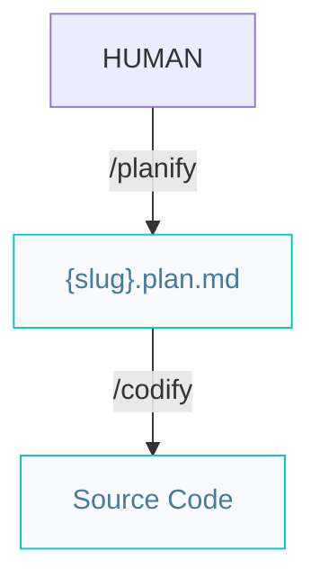
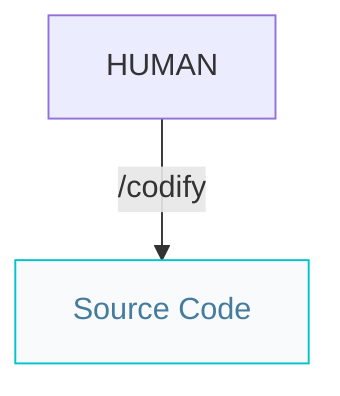

# Craftsman pipelines

## Review reports 

```mermaid
flowchart TD  
  HUM[HUMAN]
  RPT["{slug}.report.md"]:::nd
  PLN["{slug}.report.{tier?}.plan.md"]:::nd
  COD[Source Code]:::nd

  HUM -->|/review| RPT
  RPT -->|/planify| PLN
  PLN -->|/codify| COD

  classDef nd fill:#f8fafc,stroke:#00c4cc,color:#457b9d
```

## Simple bug fixes or improvements

```mermaid
flowchart TD  
  HUM[HUMAN]
  PLN["{slug}.plan.md"]:::nd
  COD[Source Code]:::nd

  HUM -->|/planify| PLN
  PLN -->|/codify| COD

  classDef nd fill:#f8fafc,stroke:#00c4cc,color:#457b9d
```

## Minor changes

```mermaid
flowchart TD  
  HUM[HUMAN]
  COD[Source Code]:::nd

  HUM -->|/codify| COD

  classDef nd fill:#f8fafc,stroke:#00c4cc,color:#457b9d
```

