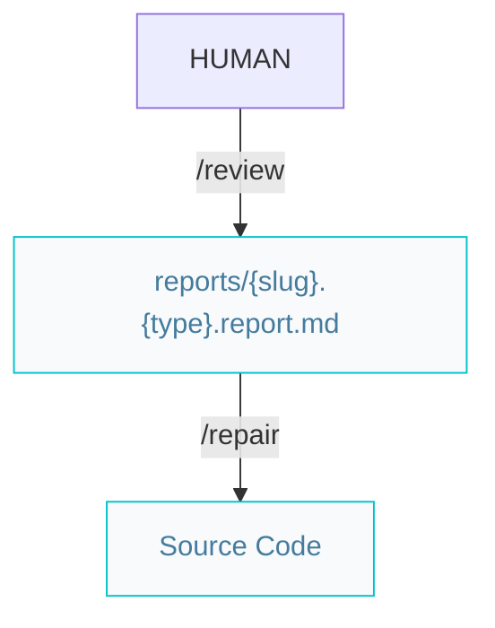
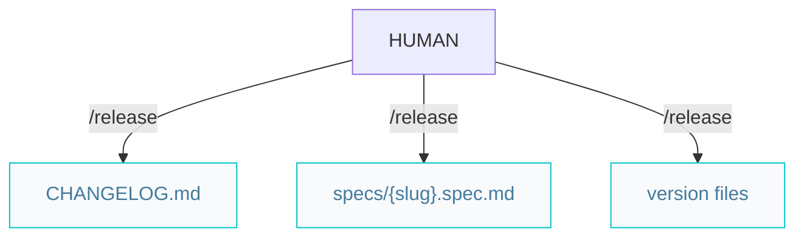

# Craftsman pipelines

Paths below are under `{Product_Folder}` (default `.product/`).

## Repair

Use `/repair` for findings from `/review` or `/verify` reports.

`/review` and `/repair` commit reports and fixes via [`/repository`](/.agents/skills/repository/). Use `fix/{slug}` only when not on an active `feat/{slug}` feature branch.

## Release

Requires specs at `status: verified`. Sets `released`, bumps semver, updates `CHANGELOG.md` and `README.md`.

