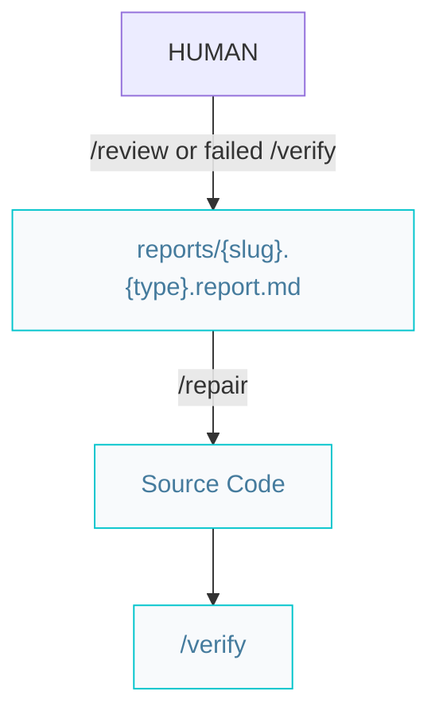
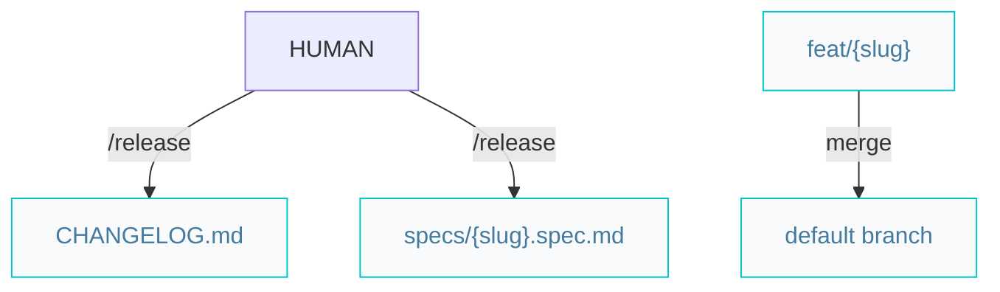

# Craftsman pipelines

Paths below are under `{Product_Folder}` (default `.product/`).

## Review and repair

Use `/repair` for findings from `/review` or `/verify` reports. Review repairs preserve behavior unless fixing a defect; verify repairs may change behavior to meet acceptance criteria.

`/review` and `/repair` commit via [`/repository`](/.agents/skills/repository/). Use `fix/{slug}` only when not on an active `feat/{slug}` branch.

## Release

Requires specs at `status: verified`. Sets `released`, bumps semver, updates `CHANGELOG.md` and targeted docs. **Merge `feat/{slug}` to the default branch** before release unless the user confirms releasing from the feature branch.

Blocking checks: open `*.verify.report.md` or unresolved review reports for slugs in scope (unless waived).
