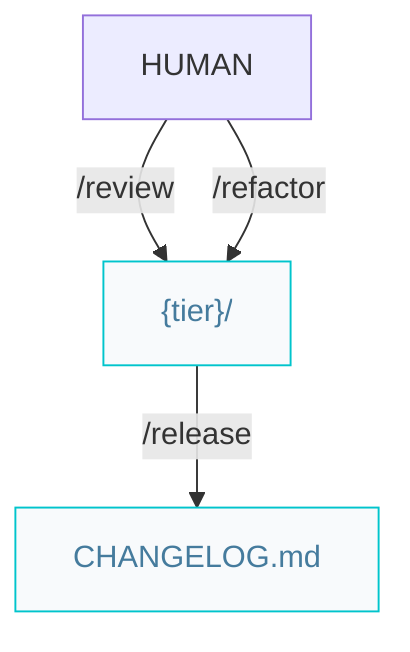

# Craftsman pipelines

Paths below are under `{Product_Folder}` (default `.product/`).

## Quality and release



Both **`/review`** and **`/refactor`** are **scope-bound**: they run discretionally over a code scope (feature branch, plan files, explicit paths, or an optional spec slug that resolves to that spec's plan files) and only emit a commit — they never change spec or plan `status`. They edit code in place, then commit one detailed conventional message; run unit and E2E tests (or **`/verify`**) afterward.

**`/release`** is **spec-bound**: it operates on a spec and closes its lifecycle by setting `status: done` + `released-version`.

### Workflow

```markdown
/review -> /release
```

Optional (clean code / DRY):

```markdown
/refactor -> (tests) -> /release
```
