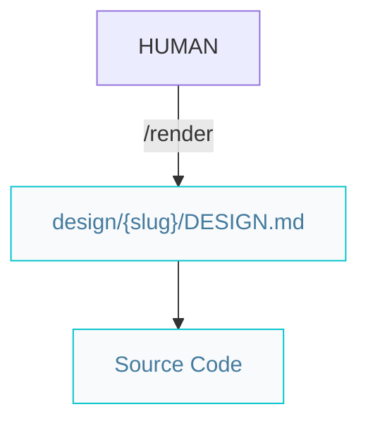
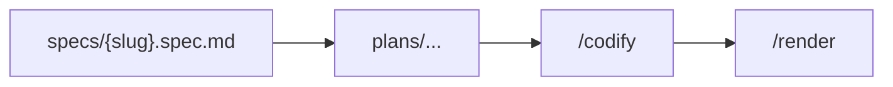

# Designer pipelines

Paths below are under `{Product_Folder}` (default `.product/`) unless noted.

## Standalone UI (experimental)

Place the design spec at `design/{slug}/DESIGN.md` or pass a path explicitly. `/render` commits UI via [`/repository`](/.agents/skills/repository/) on `feat/{slug}` when tied to a feature.

## Optional: spec-driven design work

For design systems that are part of a product feature:

Then `/review` (quality) on the implementation and `/repair` as needed.
