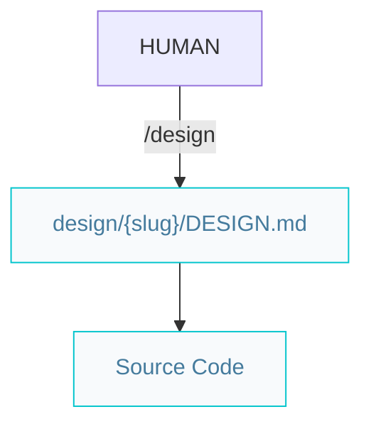
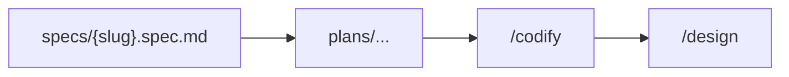

# Designer pipelines

Paths below are under `{Product_Folder}` (default `.product/`) unless noted.

## Standalone UI

Place the design spec at `design/{slug}/DESIGN.md` or pass a path explicitly. Use existing `feat/{slug}` or create it per `AGENTS.md` before UI commits (same as `/codify`). Git: [`/design` skill](../.agents/skills/design/SKILL.md) and [`/repository`](../.agents/skills/repository/SKILL.md).

## Optional: spec-driven design work

For design systems that are part of a product feature:

Then `/review` on the implementation (a11y, security, performance) and `/repair` as needed; optionally `/refactor` for clean-code passes without a report.
