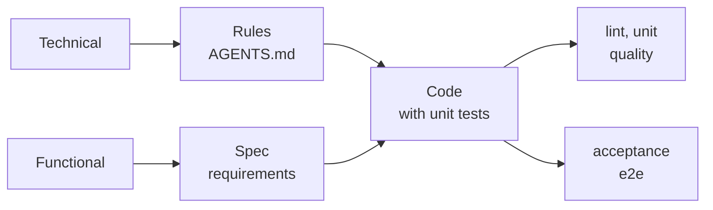

# Engineering

These principles drive the management of the development. They tell when to do the work, in which sequence, and how to accept it. The [principles](../principles/README.md) tell how to make the code.

Read them in the sequence of the life of a system:

1. [Foundation](./foundation.md): the start of the system.
2. [Features](./features.md): the delivery of each spec.
3. [Future](./future.md): the debt and the repairs.

## Overview

A solution has a technical part and a functional part. Each part has its documentation first. The two parts converge in the code. Then each part has its own verification.

| Step | Technical | Functional |
| --- | --- | --- |
| Documentation | The rules: the Blueprint of the root `AGENTS.md` and the `AGENTS.md` of each project. The [foundation](./foundation.md) writes them from the [principles](../principles/README.md). | The [spec](./features.md#definition), with its requirements in EARS. |
| Code | The [code](./features.md#coding) obeys the rules. | The [code](./features.md#coding) and its unit tests implement the spec. |
| Verification | `lint` and `unit` block. `quality` measures complexity, folder size and duplicated code; it never blocks. | The full acceptance suite, in the `e2e` project. It blocks. |

A finding that does not block becomes debt. The [future](./future.md) pays it.

> **Sources.** The [AIDD workflow](../AIDD.workflow.md) shows the skills that apply these principles. If you change a principle, change its source with `/maintain-skills`.
