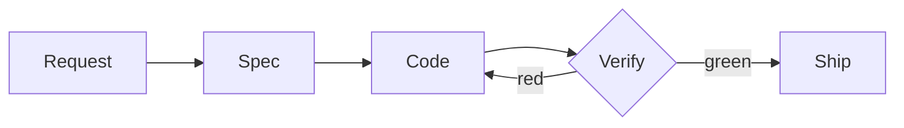

# Features

Deliver one spec at a time. Only one spec is open at a time. Each spec has its own branch.

## Definition

The Architect turns one request into one spec.

- A spec has a type: `feat`, `fix`, `refactor` or `chore`.
- A spec has requirements in EARS: `R01`, `R02`, … Other records cite them as `S0042-R03`.
- A spec looks forward. It does not list shipped requirements.
- A spec declares each change to the [schemas](../principles/data.md#schemas) and each endpoint.
- The human approves the spec before the code starts. In YOLO mode, the spec is approved when it is written. The approval commits the spec.

## Coding

The Builder implements the spec in each project that changes.

- Implement the projects from the lower abstraction to the higher.
- Write a plan before the first edit.
- Write the code and its unit tests. Write the necessary acceptance tests in the `e2e` project.
- Each requirement has at least one acceptance test with its identifier.
- Run `lint` and `unit` during the work. A commit needs a green `lint` on the same files.

## Verification

The Craftsman proves the work. It is a different agent from the Builder.

- First verify the behavior: run `unit`, then the full acceptance suite. Only one run operates at a time.
- Then review the implementation. A failure of security, accessibility, the project rules (such as the layer boundaries) or the schema impact makes the review red. Data integrity, performance and names are debt checks.
- A red verification goes back to the Builder. Stop only for a product question or for acceptance tests that cannot run.
- At revision 3, a red verification does not block. Its failures become debt.
- A review finding does not block. It becomes debt. A security finding gets one repair.
- Ship the spec when the verification is green, or at revision 3. Shipping formats the code, updates the schemas, and releases the next version: a `feat` adds a minor version, any other type a patch, and a breaking change a major version.

Skill: [`/build-requested-spec`](../../.agents/skills/build-requested-spec/SKILL.md).

---

← [Foundation](./foundation.md) · [Engineering](./README.md) · [Future](./future.md) →
