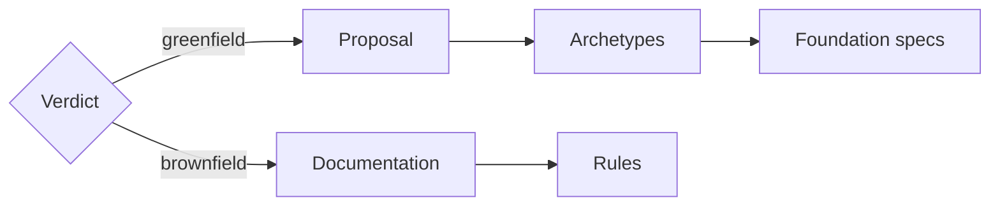

# Foundation

Start the system before you deliver business value. The Architect gives a verdict: greenfield or brownfield. The route depends on it.

## Greenfield

The repository has no application code. Make the system from scratch.

- An approved proposal in `.product/system.md` comes first. It sets the typed [projects](../principles/project.md) of the [system](../principles/system.md). Do not write code before the approval.
- Each project starts from an archetype of its kind:
  - Use an archetype from the catalog, such as Archetype Base.
  - Or make an archetype for the selected technology. It fills the Archetype-Blueprint and stays in `.product/archetypes/`.
- The root `AGENTS.md` gets the Blueprint: the architecture and the general coding rules. Each project gets a short `AGENTS.md` with only its own data and rules.
- The foundation specs come before the business specs.
- The foundation is complete only when `lint`, `unit` and `acceptance` pass.

## Brownfield

The repository has existing code. Learn the system that exists.

- Document the code. Do not change it.
- Record the rules and classify the commands of each project.
- Do not run the tests or the `quality` check. Do not record debt.

## Tracking

The installation prepares the records. They tell the state of the development. The tools write them. Do not write them by hand.

| Record | What it tells | Who reads it |
| --- | --- | --- |
| Journal | The story of the process: each step, each decision and its time. | Humans. No code reads it. |
| PRD | The product view: one line for each shipped `feat` spec, by domain. | Humans. |
| Debt | The open technical debt, with its priority, evidence and origin. | The repairs of the [future](./future.md). |

- The journal is only a story. Do not make a decision from it.
- A release writes the PRD. A `fix`, a `refactor` or a `chore` does not add a line.
- Each change to the debt is a commit. A repaired item goes away.

Skill: [`/architect-system-foundation`](../../.agents/skills/architect-system-foundation/SKILL.md).

---

[Engineering](./README.md) · [Features](./features.md) →
