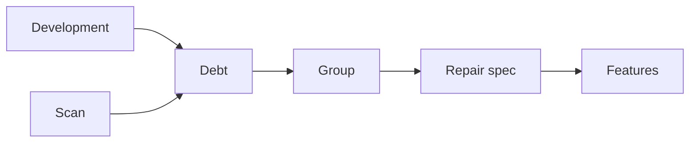

# Future

Keep the system easy to change. Pay the debt.

## Sources of debt

Debt comes from two sources:

- **Development.** A finding that does not block a delivery becomes debt. Examples: a review finding, or a failure at revision 3 of a [feature](./features.md#verification). Its origin is the spec.
- **Scan.** The `quality` check measures the code. Its origin is `scan`.
  - Complexity over the [limits](../principles/complexity.md#limits).
  - Folders with too many entries, and subfolders in a feature.
  - Duplicated blocks of code (DRY): the repair moves each block to one function.

Record each debt with its priority, its evidence and its origin. Do not hide it. Scan from time to time, not after each spec.

## Payment

1. Prioritize the debt:
   - `high`: it breaks the behavior, the security or the data.
   - `medium`: it makes a change slow or difficult.
   - `low`: all other debt.
2. Select one coherent group of related items.
3. Make a repair spec for the group.
4. Send the spec through the normal [features](./features.md) flow.

- A repair is a [craft pass](../principles/glossary.md). It keeps the behavior, except a `fix` for debt that breaks it.
- An upgrade of the dependencies skips the scan: it is a `chore` that repairs all that the upgrade breaks.
- A repaired item goes away from the debt.

Skill: [`/craft-lasting-quality`](../../.agents/skills/craft-lasting-quality/SKILL.md).

---

← [Features](./features.md) · [Engineering](./README.md)
