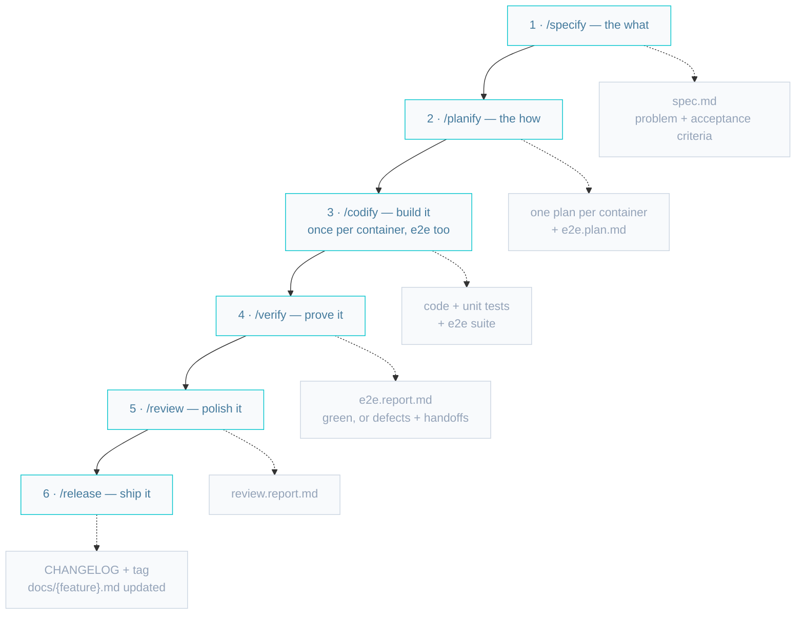
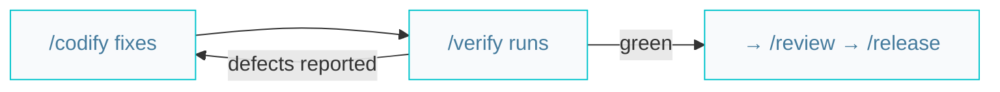

# Building a feature

From idea to release in six steps. One skill per step, one artifact per step, one
question at each gate. The [full picture](./AIDD.diagrams.md) has the details — this is
the happy path.



1. **`/specify`** — a one-page ticket: the problem, expected results per container, and
   testable acceptance criteria. No technology, no steps.
2. **`/planify`** — one plan per affected container, grounded in the architecture docs.
   The e2e plan maps one test scenario to each acceptance criterion.
3. **`/codify`** — one run per plan; sessions can run in parallel. The e2e suite is
   built like any other container (its tests stay red until the features land — that's
   expected).
4. **`/verify`** — runs the suite and reports. It never fixes: defects go back to
   `/codify`, each with a handoff.
5. **`/review`** — audits the scope (a11y, security, performance, clean code) and
   reports findings.
6. **`/release`** — bumps the version, updates the changelog and the feature doc,
   closes the spec.

## When the suite is red

Verify reports, codify fixes, verify re-runs — until green.



## The prompts, end to end

```markdown
/specify riders can rate a trip 1 to 5 stars
/planify the specification
/codify the api plan
/codify the web plan
/codify the e2e plan
/verify the feature
/codify the e2e report          (only if defects)
/verify the feature             (until green)
/review the feature branch
/release
```
