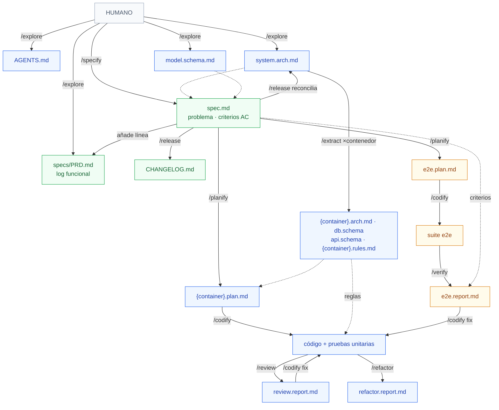

# Flujo de artefactos — negocio vs. arquitectura

Vista en español del proceso desde sus artefactos: qué **consume** (←) y qué **produce** (→) cada
skill, separado en dos dimensiones —lo que toca del **producto/negocio** y lo que toca de la
**arquitectura/tecnología**—. Complementa la doc canónica del workflow
([AIDD.workflow.md](./AIDD.workflow.md)), que es la imagen completa en inglés.

## Qué consume y produce cada skill

| Skill | Producto / Negocio | Arquitectura / Tecnología |
|---|---|---|
| **explore** | ← pistas de problema/solución en los docs → armazón del **PRD** (párrafo de producto) | ← árbol del repo, archivos de guía → `AGENTS.md`, `system.arch.md`, `model.schema.md` |
| **extract** | — | ← `system.arch.md`, `AGENTS.md`, fuente del contenedor → `{container}.arch.md` / `db.schema.md`, `api.schema.md`, `{container}.rules.md`, enlace **Detail** |
| **specify** | ← requisito / descripción de funcionalidad → `spec.md` (problema, historias, reglas RuleSpeak, **criterios de aceptación**), línea en el PRD | ← `system.arch.md`, `model.schema.md` → resumen de **solución** (resultados por contenedor) dentro de la spec |
| **planify** | ← criterios de aceptación de la spec → `e2e.plan.md` (un escenario por AC) | ← arquitectura/esquema de contenedor, formas API/DB → `{container}.plan.md` por contenedor · spec → `planned` |
| **codify** | ← criterios de la spec (modo e2e) → spec → `in-progress` (señal de avance) | ← planes, `{container}.rules.md`, formas API/DB → **código** funcional, pruebas unitarias, suite e2e · pasos del plan marcados |
| **verify** | ← criterios de aceptación → veredicto por AC · spec → `verified`/`failed` · casillas | ← `e2e.plan.md`, suite e2e, formas API/DB → `e2e.report.md` (defectos triados por tipo) |
| **review** | → hallazgos de **comportamiento** reingresan a `/specify` | ← código en alcance, `{container}.rules.md`, definiciones de compuertas → `review.report.md` (veredicto por compuerta, hallazgos) |
| **release** | ← spec verificada → `CHANGELOG.md` (Added/Changed/Fixed/Removed) · spec → `done` + `released-version` | ← informe de revisión, deriva de docs → bump de versión, docs de arquitectura/modelo reconciliados, merge + tag, poda de rama |
| **refactor** | → hallazgos de **comportamiento** reingresan a `/specify` | ← código de toda la app, `{container}.rules.md`, lentes → `refactor.report.md` (hallazgos triados) |

> **skillify** queda fuera: es meta (fuera de la tubería SDLC). No toca artefactos de producto ni
> de arquitectura — produce o arregla las propias skills.

## Diagrama de flujo de artefactos

Colores por dimensión: **verde = producto/negocio**, **azul = arquitectura/tecnología**,
**ámbar = la cadena e2e**, que es la bisagra por donde el negocio (criterios) cruza a la técnica
(pruebas) y vuelve (veredicto). Línea continua = produce; línea punteada = consume/informa.

## Lo que se lee de un vistazo

- **explore → specify → release** cargan el peso de **producto/negocio** (PRD, spec, criterios,
  CHANGELOG). El hilo de negocio es la spec y sus `AC-{spec_id}.{n}`.
- **extract, planify, codify, review, refactor** son casi puramente **arquitectura/tecnología**.
- La **cadena e2e** (criterios → `e2e.plan.md` → suite → `e2e.report.md` → veredicto) es la
  bisagra entre ambas dimensiones; **verify** es quien la cruza: consume negocio y produce un
  juicio técnico que actualiza el estado de negocio de la spec.
- Los dos **informes de auditoría** (review, refactor) solo tocan negocio cuando detectan un
  cambio de comportamiento → lo devuelven a `/specify`.
