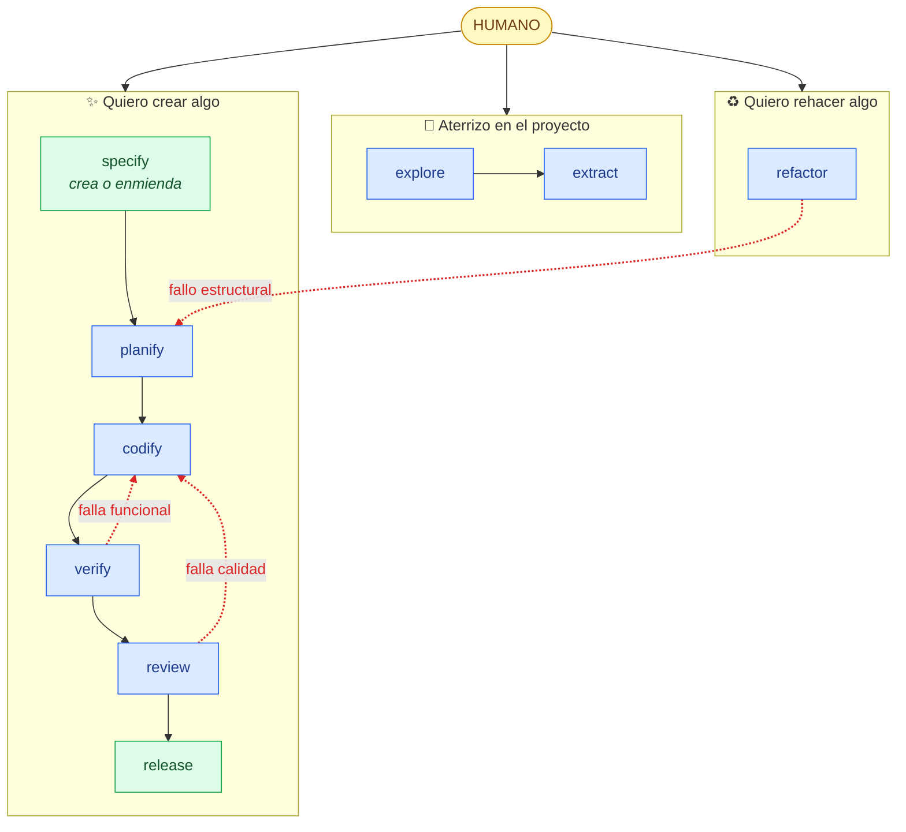

# Flujo de artefactos — negocio vs. arquitectura

Vista en español del proceso: los **tres escenarios** con los que un humano llega, qué skills
recorre cada uno, y dónde está el **negocio** frente a la **tecnología**. Complementa la doc
canónica del workflow ([AIDD.workflow.md](./AIDD.workflow.md)), que es la imagen completa en
inglés.

## Los tres escenarios

**Leyenda:** 🟢 verde = **negocio** (el *qué* y el *porqué*: capturar y publicar) · 🔵 azul =
**tecnología** (el *cómo*: documentar, construir, juzgar) · 🔴 rojo punteado = **bucles** (un
fallo o una auditoría que reingresa al pipeline).

## Lo que se lee de un vistazo

- **Tres puertas de entrada**, no una: *aterrizo* (preparar el terreno), *creo* (pedir una
  funcionalidad), *rehago* (auditar y limpiar lo acumulado).
- **La enmienda la decide `specify`**, no es una vuelta desde `release`: alguien pide algo y
  `specify` decide si es una spec nueva o la enmienda de una existente.
- **El negocio abre y cierra**: crear algo va de `specify` (negocio) → construir/juzgar
  (tecnología) → `release` (negocio). El humano solo habla negocio en los extremos; el centro es
  técnico.
- **Los bucles contrastan por tipo de fallo**: `verify` detecta fallos **funcionales** y los
  devuelve a `codify`; `review` devuelve fallos de **calidad** a `codify`; `refactor` detecta
  deriva **estructural** y la devuelve a `planify`.

## Detalle — qué consume y produce cada skill

| Skill | Producto / Negocio | Arquitectura / Tecnología |
|---|---|---|
| **explore** | ← pistas de problema/solución en los docs → armazón del **PRD** (párrafo de producto) | ← árbol del repo, archivos de guía → `AGENTS.md`, `system.arch.md`, `model.schema.md` |
| **extract** | — | ← `system.arch.md`, `AGENTS.md`, fuente del contenedor → `{container}.arch.md` / `db.schema.md`, `api.schema.md`, `{container}.rules.md`, enlace **Detail** |
| **specify** | ← requisito / descripción de funcionalidad → `spec.md` (problema, historias, reglas RuleSpeak, **criterios de aceptación**), línea en el PRD | ← `system.arch.md`, `model.schema.md` → resumen de **solución** (resultados por contenedor) dentro de la spec |
| **planify** | ← criterios de aceptación de la spec → `e2e.plan.md` (un escenario por AC) | ← arquitectura/esquema de contenedor, formas API/DB → `{container}.plan.md` por contenedor · spec → `planned` |
| **codify** | ← criterios de la spec (modo e2e) → spec → `in-progress` (señal de avance) | ← planes, `{container}.rules.md`, formas API/DB → **código** funcional, pruebas unitarias, suite e2e · pasos del plan marcados |
| **verify** | ← criterios de aceptación → veredicto por AC · spec → `verified`/`failed` · casillas | ← `e2e.plan.md`, suite e2e, formas API/DB → `e2e.report.md` (defectos triados por tipo) |
| **review** | → hallazgos de **comportamiento** reingresan a `/specify` | ← código en alcance, `{container}.rules.md`, definiciones de compuertas → `review.report.md` (veredicto por compuerta, hallazgos) |
| **release** | ← spec verificada → `CHANGELOG.md` (Added/Changed/Fixed/Removed) · spec → `done` + `released-version` | ← informe de revisión, deriva de docs → bump de versión, docs de arquitectura/modelo reconciliados, merge + tag, poda de rama |
| **refactor** | — (un cambio de comportamiento se señala como feature para `/specify`, no es un refactor) | ← código de toda la app, `{container}.rules.md`, lentes → `refactor.report.md`; **todo hallazgo va a `/planify`** |

> **skillify** queda fuera: es meta (fuera de la tubería SDLC). No toca artefactos de producto ni
> de arquitectura — produce o arregla las propias skills.
