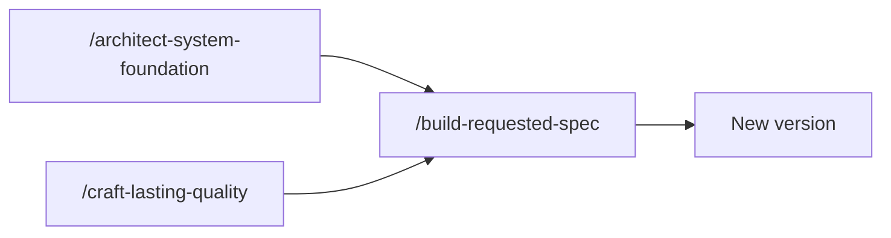
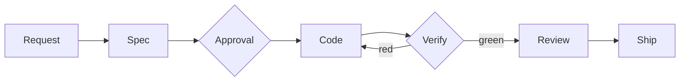

# How it works

This page gives the model of AIDDbot. For the first session, read [Getting started](./getting-started.md). For all the rules, read the [AIDD workflow](./AIDD.workflow.md).

## The idea

- **Spec first.** Each change starts as a small spec with numbered requirements. You approve it before the code starts.
- **Evidence, not trust.** Each requirement has an acceptance test. A spec ships only when its tests pass, or with its failures recorded as debt.
- **The code is the truth.** A shipped spec is a record of the change. It is never written again.
- **Models judge, code checks.** The models do the non-deterministic work: design, specs, code and review. A deterministic program, the core, runs the tests, records the results and enforces the rules. It is more reliable, faster and cheaper than a model for that work.

## Three agents

| Agent | Work |
| --- | --- |
| **Architect** | Designs the system, writes the specs, and selects the debt to repair. |
| **Builder** | Writes the code and the tests. |
| **Craftsman** | Runs the tests, reviews the code, ships the spec, and scans the quality. |

Each agent starts with a fresh context, and it reads only the skill of its step. The Craftsman is never the Builder: a different agent checks the work.

## Three commands

You start one of three commands. Each command starts the agents and the steps that it needs. The other skills in `.agents/skills/` are those steps.

### Prepare the system

`/architect-system-foundation` first decides the route. A repository with application code is **brownfield**, also when it is legacy code. A repository without application code is **greenfield**.

- **Brownfield.** The Architect reads the code and writes the documentation: the `AGENTS.md` of the system and of each project, the schemas, and the commands of each project. It does not change the code or run the tests.
- **Greenfield.** The Architect asks about your product and proposes the system: a set of typed projects, such as `back-api`, `front-web`, `cli` and `e2e`. Each project starts from an archetype. After your approval, it makes the projects and delivers the foundation specs. The foundation ends only when `lint`, `unit` and `acceptance` pass.

After the first run, each system is the same: a documented system with its rules. Thus `/build-requested-spec` and `/craft-lasting-quality` operate the same way on greenfield and brownfield code. Run the command again when the documentation must agree with the code.

### Deliver a change

`/build-requested-spec` takes one request in natural language.

1. The Architect writes one spec on its own branch, and stops for your approval.
2. The Builder writes the code, the unit tests and the acceptance tests, one project at a time.
3. The Craftsman runs `unit` and the full acceptance suite. A red result goes back to the Builder. At the third revision, the failures become debt and the spec continues.
4. The Craftsman reviews the code for security, data integrity and accessibility. A finding becomes debt.
5. Shipping merges the branch, writes `CHANGELOG.md` and `.product/PRD.md`, and tags the version: `feat` increases the minor version, other types the patch version.

Only one spec is open at a time. With `YOLO` in the request, the spec is approved when it is written, and it contains only what the request names.

### Repair debt

`/craft-lasting-quality` keeps the code easy to change.

1. The Craftsman runs the `quality` checks: complexity, large folders and duplicated code. Each problem becomes debt with a priority: `high`, `medium` or `low`.
2. The Architect selects one coherent group of debt.
3. `/build-requested-spec` repairs it. The repair needs no approval: the debt is already recorded.
4. The loop repeats while `high` debt remains, for at most five specs.

A feature can ship with quality warnings. Scan from time to time, not after each spec.

## The core guards the process

The agents call the core, `node .agents/aidd/aidd.mjs`, at each step that changes the state. It runs the tests, records the evidence, and refuses each step that breaks a rule. Thus a model that forgets a step cannot ship. You never run it by hand.

Read [The core](./core.md) for the details.

## Where to look

| Where | What |
| --- | --- |
| `.aiddbot/journals/` | One log for each day. Each line is one step, with its time and result. Git ignores it. |
| `.product/system.md` | The approved system proposal. |
| `.product/specs/` | One folder for each spec, with its requirements and its evidence. |
| `.product/PRD.md` | The shipped features, by domain. |
| `.product/quality/debt.json` | The open debt. |
| `.product/model/` | The schemas of the data and the API. |
| `AGENTS.md` | The architecture and the rules of the system. Each project has its own `AGENTS.md`. |
| `.aiddbot/config.json` | The projects and their commands. |

The records use your language. The code, the tests and the user interface use English, unless you ask for a different language.

## Learn more

- [The core](./core.md): the guards, the files and the commands of the process.
- [AIDD workflow](./AIDD.workflow.md): the skills, the evidence and the records, in detail.
- [Engineering principles](./engineering/README.md): how the development is managed.
- [Principles](./principles/README.md): the architecture and the code.
- [Customize agent profiles](./agent-customization.md): select the models and the effort.
