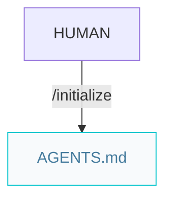
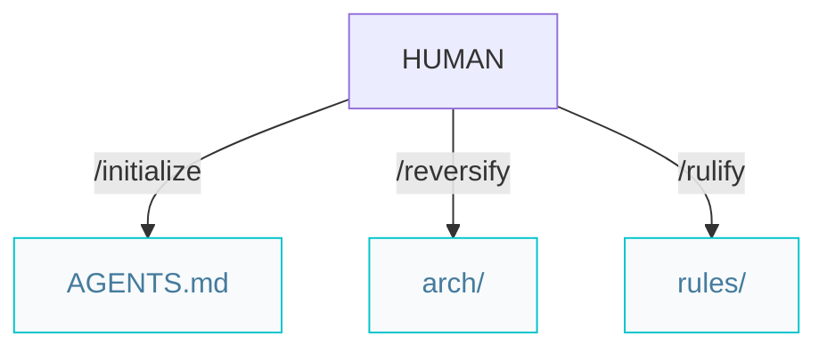

# Initialize pipelines

## Greenfield projects from scratch

```mermaid
flowchart TD  
  HUM[HUMAN]
  AGT["AGENTS.md"]:::nd

  HUM -->|/initialize| AGT

  classDef nd fill:#f8fafc,stroke:#00c4cc,color:#457b9d
```

## Brownfield projects with legacy code

```mermaid
  flowchart TD  
    HUM[HUMAN]
    AGT["AGENTS.md"]:::nd
    ARCH["arch/"]:::nd
    RUL["rules/"]:::nd

    HUM -->|/initialize| AGT
    HUM -->|/reversify| ARCH
    HUM -->|/rulify| RUL

    classDef nd fill:#f8fafc,stroke:#00c4cc,color:#457b9d
```