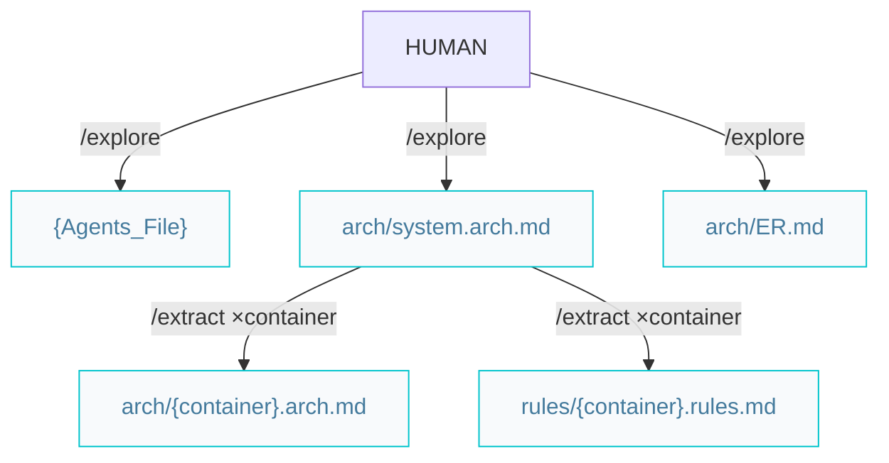
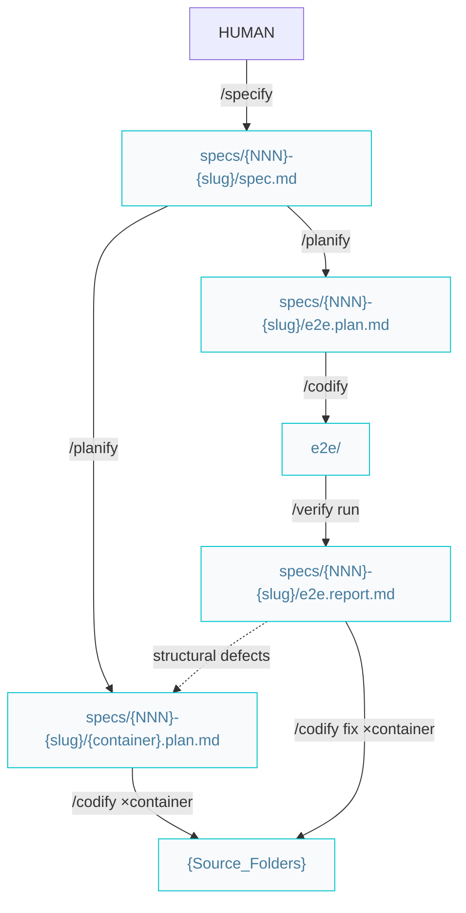
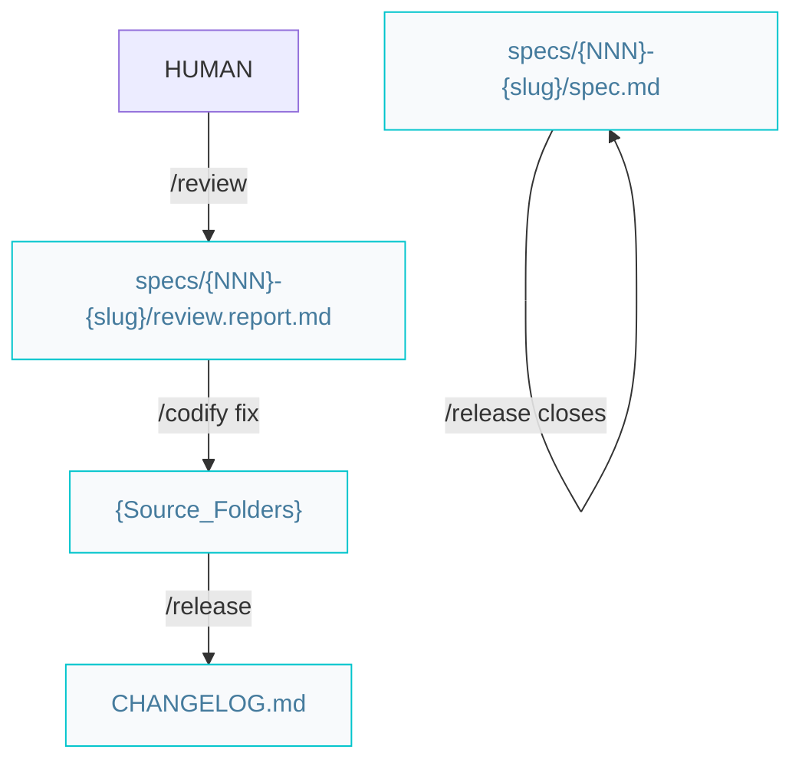

# Skill pipelines

Phase diagrams for the 8 skills: set up the context, build features, guard quality and
ship. Paths below are under `{Product_Folder}` (e.g. `docs/` or `.product/`) and
`{Agents_Folder}` (e.g. `.agents/`), as declared in the root `{Agents_File}`.

## Set up the context



```markdown
/explore -> /extract (×container)
```

Both steps apply **evidence wins**: they extract from the codebase where code exists and
prescribe defaults (marked *intended*) where it doesn't. The rule resolves per gap: one
repo can mix extracted containers and prescribed ones.

- `/explore` sets up AIDD and documents the system (C4 L2):
  - Root `{Agents_File}` (`AGENTS.md` | `CLAUDE.md`) — environment, paths, git rules, status chain, product brief.
  - `arch/system.arch.md` — containers diagram with per-container details.
  - `arch/ER.md` — the domain Entity-Relationship diagram (kept separate as it grows large).
- `/extract` documents **one container per invocation** (C4 L3):
  - `arch/{container}.arch.md` — components diagram, code organization, contract surface.
  - `arch/db.schema.md` / `arch/api.schema.md` — system-wide field-level database/API schema, kept separate as they grow large; written when the owning container is extracted (when applicable).
  - `{Agents_Folder}/rules/{container}.rules.md` — naming, conventions, one canonical example.

When every container is documented, start features with `/specify`.

## Build a feature

All feature artifacts live together in `specs/{NNN}-{slug}/` (`spec.md`, `{container}.plan.md`, `e2e.plan.md`, `e2e.report.md`); `specs/PRD.md` indexes the specs by feature area. E2E test code stays in the solution (`e2e/`), organized by feature.



```markdown
/specify -> /planify -> /codify (×container) -> /verify
```

Division of labor:

- `/specify` — the **what**: problem, per-container expected results, acceptance criteria numbered `AC-{NNN}.{n}`. No technical detail. Also appends the spec's line to `specs/PRD.md` (sole writer).
- `/planify` — the **how**: one plan per affected container, the transversal `e2e.plan.md` included (one scenario step per AC id). Shared contracts (API shapes, schemas) are stated verbatim in every sibling plan.
- `/codify` — one container plan per run; sessions can run in parallel. Functional code + unit tests — and the e2e suite, implemented from `e2e.plan.md` like any plan (done when it executes; red against unverified features is expected). If an in-scope change would alter a shared contract, it hands back to `/planify` — never improvises a cross-container change.
- `/verify` — **report-only**: runs the e2e suite, writes `e2e.report.md` with a verdict per AC id plus a kind and handoff per defect, and marks the spec's acceptance criteria `[x]/[ ]`. It never edits code, tests, or plans — implementation and evaluation never share a session.

When the suite is not green, `/verify` triages each defect by kind; the handoff routes the fix:

```markdown
code bug | test bug  -> /codify the e2e.report.md (×affected container) -> /verify re-runs
structural           -> escalate: /planify the e2e.report.md -> /codify -> /verify
```

## Quality and release



```markdown
/verify (green) -> /review -> /codify fixes (or --fix) -> /verify -> /release
```

### `/review` — scope-bound quality

Audits a code scope (feature branch, plan/spec files, or explicit paths) for **a11y, security, performance, and clean-code/DRY**, and writes `review.report.md` — each finding with a dimension, severity, kind, and handoff. Report-only by default: fixes land via `/codify` with the report; an explicit `--fix` applies the mechanical findings (renames, dead code, extractions) directly. It never changes spec or plan status.

Guardrails worth knowing:

- **Green baseline gate** — it refuses to start on a failing suite; run `/verify` first.
- **Behavior findings are not its call** — a finding whose fix would change observable behavior needs a spec: handed to `/specify`.
- **Contracts are frozen** — restructuring shared API shapes, schemas, or component boundaries is a structural refactor: handed to `/planify`.

### `/release` — close the loop

Bumps the version (SemVer), finalizes `CHANGELOG.md`, reconciles arch docs, and closes
the spec (`status: done`, `released-version`) when one is in scope.

### Maintenance — no triage skill

Changes to **released** features route on one mechanical question — *would satisfying the request change what a green e2e test asserts?* Either door bounces a misrouted request to the other.

| Answer | It is a... | Route |
|---|---|---|
| No green test flips | defect (or coverage gap) | `/codify` fix mode + regression e2e test → patch `/release` |
| A green test must flip | behavior change | a new spec via `/specify` → full pipeline → `/release` |

```markdown
/codify (fix + regression test) -> /release       (defect)
/specify -> ... -> /release                       (behavior change)
```
