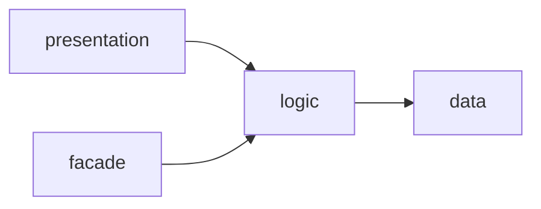

# Feature

A feature is one flat folder. It has layers. The role in each file name shows its layer.

## Layers

- `presentation` holds the input, the output and the registration of the feature: routes, pages or commands. It has no business rules. It depends on `logic`. Only the composition imports it.
- `facade` gives the public functions and types of the feature to other features. It depends on `logic`. Only other features import it. A feature that gives nothing to other features has no facade.
- `logic` holds the business rules and the decisions. It depends on `data`.
- `data` reads and writes outside the project: database, remote API, files. It does not depend on other layers.
- `types` holds the types and the value objects. It is not a layer.
- A layer never skips the next one: `presentation` never calls `data`. Only the registration creates `data` and gives it to `logic`.
- All layers can use `types`, `shared` and the facades of other features.

---

← [Project](./project.md) · [Principles](./README.md) · [Data](./data.md) →
