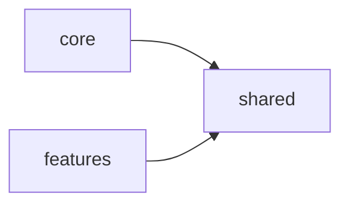

# Project

- A project is a unit of code that you deploy alone.
- It belongs to one tier of the system.
- It starts from an archetype.
- It has one kind: `back-api`, `front-web`, `cli` or `e2e`.

## Archetype

An archetype is a base project of one kind, with one technology.

- It sets the language, the framework and the dependencies.
- It gives the basic foundation of the framework.
- It gives the coding rules of its technology.

## Containers

A project has three containers.

- `shared` holds generic elements with no domain. It depends on nothing.
- `core` is a special feature. The framework or the entry file calls it one time at startup. It has no business rules. It depends only on `shared`.
  - Examples: Express middlewares, Angular root services, global web styles.
- `features` holds the business. Each feature is a unit of business value. It depends only on `shared`. It uses a different feature only through the facade of that feature.
  - Examples: API endpoints, web pages, CLI commands.
- `core` and `features` do not know each other.

### Composition

- The entry point composes the project. It starts `core` and registers each feature by name, in one explicit list. It is the only part that knows `core` and `features`.

## Unit tests

- A unit test proves one business rule, without external systems.
- If possible, put the unit tests next to the code that they test.
- A unit test is fast. It does not depend on a different test. It gives the same result each time.
- Test the rules of the business, not the framework.
- Also test the elements of `shared` and the services of `core`.
