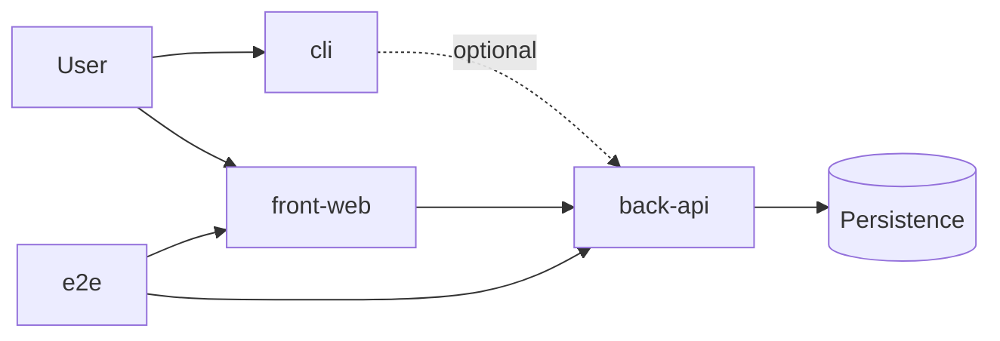

# System

The system architecture is a classic three-tier architecture. The projects of the system communicate through REST APIs.

> Out of scope: microservices, event-driven architecture, message queues, pub/sub, GraphQL, gRPC, WebSockets.

A system is a set of projects. Each project has one type.

- `back-api` owns the data. Only it connects to persistence.
- `front-web` and `cli` serve the user. They get data only through `back-api`.
- `e2e` tests the flows across projects. It is not part of the product.
- The same principles apply to all projects. An archetype adds the technology.

## REST API

`back-api` gives one REST API to the other projects.

- Paths start with `/api`. A resource is a plural noun: `/api/users`, `/api/users/:id`.
- Methods: `GET` reads, `POST` creates or does an action, `PUT` replaces, `PATCH` changes part, `DELETE` removes.
- Bodies are JSON. Dates are ISO 8601 strings.
- A protected request sends `Authorization: Bearer <token>`.
- Status codes: 200, 201, 204, 400, 401, 403, 404, 409, 413, 500.
- Every error has one body: `{ "error": "<message>" }`. An input error adds `fields`: `{ "<field>": "<message>" }`.
- An error never shows internal details: no stack, no SQL, no paths.

## Security

- Keep secrets out of the code and out of the repository.
- Store a password only as a salted hash.
- Check each input at the edge.
- A security finding gets one repair before the delivery. If the second review still finds it, it ships as `high` debt.

---

← [Principles](./README.md) · [Project](./project.md) →
