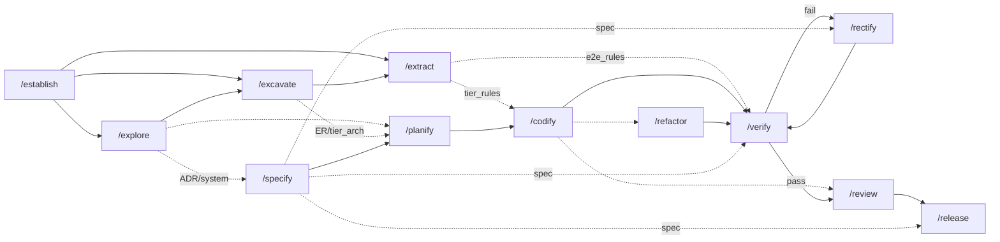

# AIDD Skills Interrelationship Report

Analysis of the 12 skills in `.agents/skills/`, mapping producers, artifacts, and consumers.

## Producer -> Artifact -> Consumer matrix

| Producer | Artifact | Consumer(s) |
|----------|----------|-------------|
| `/establish` | `AGENTS.md` | `*` (every skill reads paths/mode/tech: `/explore`, `/excavate`, `/extract`, `/specify`, `/planify`, `/codify`, `/verify`) |
| `/establish` | `SOUL.md` | `*` (personality + git/branch rules) |
| `/explore` | `arch/system.arch.md` | `/excavate`, `/specify`, `/planify`, `/verify` |
| `/explore` | `arch/ADR.md` | `/excavate`, `/specify`, `/planify`, `/codify` |
| `/excavate` | `arch/{tier}.arch.md` | `/extract`, `/planify`, `/release` |
| `/excavate` | `arch/ER.md` | `/planify`, `/codify` (relationship/cross-entity rules enforced during codify) |
| `/extract` | `rules/{tier}.rules.md` | `/codify` |
| `/extract` | `rules/e2e.rules.md` | `/verify` |
| `/specify` | `specs/{slug}/spec.md` | `/planify`, `/verify`, `/rectify`, `/release` |
| `/planify` | `specs/{slug}/{tier?}.plan.md` | `/codify`, `/review` (plan-scope), `/refactor` (plan-scope) |
| `/codify` | Source code + unit tests (`{tier}/`) | `/verify`, `/review`, `/refactor`, `/rectify` |
| `/verify` | E2E tests (`e2e/`) | re-run by `/verify` |
| `/verify` | `specs/{slug}/verify.md` (+ marks spec criteria `[x]/[ ]`) | `/rectify` |
| `/rectify` | Patched source code (+ trims `verify.md` Rectify guide) | `/verify` (re-run to confirm) |
| `/review` | Patched code + `fix` commit | `/release`, `*` |
| `/refactor` | Refactored code + `refactor`/`chore` commit | `/verify` (re-test), `*` |
| `/release` | `CHANGELOG.md`, version bump, README/docs, spec -> `done` + `released-version` | HUMAN / `*` |

## Status mutations (spec-bound chain)

Only these transitions touch frontmatter `status`, which is the backbone of traceability:

- `/specify` -> spec `pending`
- `/planify` -> spec `in-progress` (on branching), plan `pending`
- `/codify` -> plan `in-progress` -> `done` (spec stays `in-progress`)
- `/verify` -> marks spec acceptance criteria `[x]/[ ]`; `verify.md` -> `pass`|`fail` (spec stays `in-progress`)
- `/rectify` -> mutates nothing (commit-only; next `/verify` owns re-marking)
- `/release` -> spec `done`, `released-version: {new_version}`

`/review` and `/refactor` are **scope-bound** — they emit only a commit and never mutate spec/plan status.

## Dependency graph (who blocks whom)

## Key observations

1. **`AGENTS.md` is the universal context root.** Every downstream skill reads it for `{Product_Folder}`, `{Rules_Folder}`, tiers, tech stack, and **Starting mode** (greenfield/brownfield). It's the most-consumed artifact and the only one with a `*` consumer.

2. **The architect tier is a strict prerequisite chain**, not a loop: `establish -> explore -> excavate -> extract`. Each is mode-aware (prescriptive greenfield / descriptive brownfield) and each later skill explicitly tells you to run the missing predecessor.

3. **`spec.md` is the builder's source of truth** with the widest builder fan-out (4 consumers) and the longest status lifecycle (`pending -> in-progress -> done`), threading through `/specify`, `/planify`, `/verify`, `/release`.

4. **`/verify` is the only branching node.** It produces *two* artifacts — the E2E suite and `verify.md` — and routes on outcome: `fail -> /rectify`, `pass -> /review`. The `/verify <-> /rectify` cycle is the only true feedback loop; `/rectify` deliberately mutates no status so the next `/verify` remains the sole authority on acceptance state.

5. **Separation of `verify.md` vs `spec.md`.** The spec carries only `[x]/[ ]` acceptance state; the **Rectify guide** (failures, expected/actual, suggested fixes, evidence) lives in `verify.md`. This keeps the durable contract (spec) free of transient run details.

6. **Craftsman skills are decoupled side-channels.** `/review` and `/refactor` consume code by *scope selector* (branch / plan / paths / spec slug) rather than by status, emit only commits, and never block the pipeline. `/refactor` (clean-code/DRY) and `/review` (a11y/security/perf) are deliberately disjoint, with cross-references steering misrouted requests.

7. **`/release` is the only sink** — it consumes verified specs and `{tier}.arch.md`, and is the lone producer of `CHANGELOG.md` and the version bump, closing the spec lifecycle to `done`.

