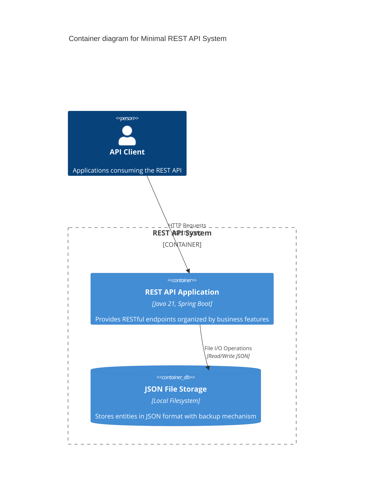

# Systems Architecture for Minimal REST API with JSON Database

## Overview

**Minimal REST API** follows a **feature-driven layered architecture**, designed for **rapid prototyping and simplicity** with **file-based JSON persistence**.

## Application Tier

### A1: REST API Service

**Purpose:** Lightweight HTTP service providing RESTful endpoints with business logic processing

**Technology Stack:**

- **Architecture Style**: Feature-driven monolith with screaming architecture
- **Integration Type:** REST API with JSON responses
- **Language**: Java 21
- **Framework**: Spring Boot 3.2+
- **Key Libraries**: Spring Web, Jackson, Spring Validation
- **Other Packages**: Lombok, SLF4J

**Responsibilities:**

- Handle HTTP requests and responses via REST controllers
- Execute business logic and validation rules
- Coordinate data operations through service layer
- Provide consistent API responses with proper status codes

**Project Structure (Screaming Architecture):**
```
src/main/java/com/example/api/
├── users/                      # User Feature Module
│   ├── UserController.java    # REST endpoints for users
│   ├── UserService.java       # Business logic for users
│   ├── UserRepository.java    # Data access interface
│   ├── UserRepositoryImpl.java # JSON file implementation
│   ├── User.java              # Domain entity
│   ├── UserRequestDTO.java    # Input data transfer object
│   └── UserResponseDTO.java   # Output data transfer object
├── products/                   # Product Feature Module
│   ├── ProductController.java
│   ├── ProductService.java
│   ├── ProductRepository.java
│   ├── ProductRepositoryImpl.java
│   ├── Product.java
│   ├── ProductRequestDTO.java
│   └── ProductResponseDTO.java
├── orders/                     # Order Feature Module
│   ├── OrderController.java
│   ├── OrderService.java
│   ├── OrderRepository.java
│   ├── OrderRepositoryImpl.java
│   ├── Order.java
│   ├── OrderRequestDTO.java
│   └── OrderResponseDTO.java
├── shared/                     # Shared Infrastructure
│   ├── config/
│   │   ├── AppConfig.java     # Application configuration
│   │   └── JsonConfig.java    # JSON serialization config
│   ├── exception/
│   │   ├── GlobalExceptionHandler.java
│   │   └── ApiException.java
│   ├── persistence/
│   │   ├── JsonFileHandler.java    # Core JSON file operations
│   │   ├── BaseRepository.java     # Common repository logic
│   │   └── FileSystemManager.java  # File system utilities
│   └── validation/
│       └── ValidationService.java  # Cross-cutting validations
└── ApiApplication.java        # Main Spring Boot application
```

**Feature Module Architecture:**
Each feature module (users/, products/, orders/) contains:
- **Controller**: HTTP request handling and response formatting
- **Service**: Business logic implementation and coordination
- **Repository Interface**: Data access contract
- **Repository Implementation**: JSON file-based data persistence
- **Entity**: Domain model representation
- **DTOs**: Request/Response data transfer objects

## Data Tier

### D1: JSON File Storage

**Database Type:** File-based JSON document storage
**Technology:** Local filesystem with atomic JSON operations

**Responsibilities:**

- Persist application data in structured JSON format
- Provide ACID-like operations through file locking
- Maintain data integrity with backup and recovery mechanisms
- Support concurrent access through synchronized operations

**File Structure:**
```
data/
├── entities/
│   ├── users.json         # User data storage
│   ├── products.json      # Product catalog storage
│   └── orders.json        # Order transaction storage
├── backups/
│   ├── users_backup.json
│   ├── products_backup.json
│   └── orders_backup.json
└── config/
    └── storage-config.json # Storage configuration
```

**Data Access Pattern:**
```json
// Example: users.json structure
{
  "entities": [
    {
      "id": "user-001",
      "name": "John Doe",
      "email": "john@example.com",
      "createdAt": "2024-01-15T10:30:00Z",
      "updatedAt": "2024-01-15T10:30:00Z"
    }
  ],
  "metadata": {
    "version": "1.0",
    "lastModified": "2024-01-15T10:30:00Z",
    "totalRecords": 1
  }
}
```

## Essential Dependencies (pom.xml)

```xml
<properties>
    <maven.compiler.source>21</maven.compiler.source>
    <maven.compiler.target>21</maven.compiler.target>
    <spring.boot.version>3.2.0</spring.boot.version>
</properties>

<dependencies>
    <dependency>
        <groupId>org.springframework.boot</groupId>
        <artifactId>spring-boot-starter-web</artifactId>
    </dependency>
    <dependency>
        <groupId>org.springframework.boot</groupId>
        <artifactId>spring-boot-starter-validation</artifactId>
    </dependency>
    <dependency>
        <groupId>com.fasterxml.jackson.core</groupId>
        <artifactId>jackson-databind</artifactId>
    </dependency>
    <dependency>
        <groupId>com.fasterxml.jackson.datatype</groupId>
        <artifactId>jackson-datatype-jsr310</artifactId>
    </dependency>
    <dependency>
        <groupId>org.projectlombok</groupId>
        <artifactId>lombok</artifactId>
        <scope>provided</scope>
    </dependency>
    <dependency>
        <groupId>org.springframework.boot</groupId>
        <artifactId>spring-boot-starter-test</artifactId>
        <scope>test</scope>
    </dependency>
</dependencies>
```

## Core Implementation Patterns

### Feature Module Implementation

#### Domain Entity (users/User.java)
```java
@Data
@NoArgsConstructor
@AllArgsConstructor
@Builder
public class User {
    private String id;
    private String name;
    private String email;
    private LocalDateTime createdAt;
    private LocalDateTime updatedAt;
    
    @PrePersist
    public void prePersist() {
        if (id == null) {
            id = UUID.randomUUID().toString();
        }
        LocalDateTime now = LocalDateTime.now();
        if (createdAt == null) {
            createdAt = now;
        }
        updatedAt = now;
    }
}
```

#### Repository Interface (users/UserRepository.java)
```java
public interface UserRepository {
    List<User> findAll();
    Optional<User> findById(String id);
    Optional<User> findByEmail(String email);
    User save(User user);
    void deleteById(String id);
    boolean existsById(String id);
    long count();
}
```

#### Service Layer (users/UserService.java)
```java
@Service
@Transactional
@Slf4j
public class UserService {
    private final UserRepository userRepository;
    private final ValidationService validationService;
    
    public UserService(UserRepository userRepository, ValidationService validationService) {
        this.userRepository = userRepository;
        this.validationService = validationService;
    }
    
    public List<UserResponseDTO> getAllUsers() {
        log.debug("Fetching all users");
        return userRepository.findAll()
            .stream()
            .map(this::toResponseDTO)
            .toList();
    }
    
    public UserResponseDTO createUser(UserRequestDTO request) {
        log.info("Creating new user with email: {}", request.getEmail());
        
        validationService.validateUniqueEmail(request.getEmail());
        
        User user = User.builder()
            .name(request.getName())
            .email(request.getEmail())
            .build();
        user.prePersist();
        
        User savedUser = userRepository.save(user);
        return toResponseDTO(savedUser);
    }
    
    private UserResponseDTO toResponseDTO(User user) {
        return UserResponseDTO.builder()
            .id(user.getId())
            .name(user.getName())
            .email(user.getEmail())
            .createdAt(user.getCreatedAt())
            .build();
    }
}
```

#### REST Controller (users/UserController.java)
```java
@RestController
@RequestMapping("/api/users")
@Validated
@Slf4j
public class UserController {
    private final UserService userService;
    
    public UserController(UserService userService) {
        this.userService = userService;
    }
    
    @GetMapping
    public ResponseEntity<List<UserResponseDTO>> getAllUsers() {
        List<UserResponseDTO> users = userService.getAllUsers();
        return ResponseEntity.ok(users);
    }
    
    @GetMapping("/{id}")
    public ResponseEntity<UserResponseDTO> getUserById(@PathVariable String id) {
        UserResponseDTO user = userService.getUserById(id);
        return ResponseEntity.ok(user);
    }
    
    @PostMapping
    public ResponseEntity<UserResponseDTO> createUser(
            @Valid @RequestBody UserRequestDTO request) {
        UserResponseDTO user = userService.createUser(request);
        return ResponseEntity.status(HttpStatus.CREATED).body(user);
    }
    
    @PutMapping("/{id}")
    public ResponseEntity<UserResponseDTO> updateUser(
            @PathVariable String id,
            @Valid @RequestBody UserRequestDTO request) {
        UserResponseDTO user = userService.updateUser(id, request);
        return ResponseEntity.ok(user);
    }
    
    @DeleteMapping("/{id}")
    public ResponseEntity<Void> deleteUser(@PathVariable String id) {
        userService.deleteUser(id);
        return ResponseEntity.noContent().build();
    }
}
```

### Shared Infrastructure Components

#### JSON File Handler (shared/persistence/JsonFileHandler.java)
```java
@Component
@Slf4j
public class JsonFileHandler {
    private final ObjectMapper objectMapper;
    private final FileSystemManager fileSystemManager;
    
    public JsonFileHandler(ObjectMapper objectMapper, FileSystemManager fileSystemManager) {
        this.objectMapper = objectMapper;
        this.fileSystemManager = fileSystemManager;
    }
    
    public <T> List<T> readEntities(String fileName, Class<T> entityClass) {
        try {
            File file = fileSystemManager.getDataFile(fileName);
            if (!file.exists()) {
                return new ArrayList<>();
            }
            
            JsonNode root = objectMapper.readTree(file);
            JsonNode entitiesNode = root.get("entities");
            
            if (entitiesNode == null || !entitiesNode.isArray()) {
                return new ArrayList<>();
            }
            
            return objectMapper.convertValue(
                entitiesNode,
                objectMapper.getTypeFactory().constructCollectionType(List.class, entityClass)
            );
        } catch (IOException e) {
            log.error("Error reading entities from file: {}", fileName, e);
            throw new DataAccessException("Failed to read data from " + fileName, e);
        }
    }
    
    public <T> void writeEntities(String fileName, List<T> entities) {
        try {
            fileSystemManager.createBackup(fileName);
            
            Map<String, Object> data = Map.of(
                "entities", entities,
                "metadata", Map.of(
                    "version", "1.0",
                    "lastModified", LocalDateTime.now(),
                    "totalRecords", entities.size()
                )
            );
            
            File file = fileSystemManager.getDataFile(fileName);
            objectMapper.writeValue(file, data);
            
        } catch (IOException e) {
            log.error("Error writing entities to file: {}", fileName, e);
            throw new DataAccessException("Failed to write data to " + fileName, e);
        }
    }
}
```

## Application Configuration

### Main Configuration (shared/config/AppConfig.java)
```java
@Configuration
@EnableConfigurationProperties
public class AppConfig {
    
    @Bean
    @ConfigurationProperties(prefix = "app.data")
    public DataStorageProperties dataStorageProperties() {
        return new DataStorageProperties();
    }
    
    @Data
    @ConfigurationProperties(prefix = "app.data")
    public static class DataStorageProperties {
        private String directory = "./data";
        private boolean backupEnabled = true;
        private int backupRetentionDays = 7;
        private boolean autoCreateDirectories = true;
    }
}
```

### Application Properties (application.yml)
```yaml
server:
  port: 8080
  servlet:
    context-path: /api

spring:
  application:
    name: minimal-rest-api
  jackson:
    default-property-inclusion: non_null
    date-format: yyyy-MM-dd'T'HH:mm:ss
    time-zone: UTC

app:
  data:
    directory: ./data
    backup-enabled: true
    backup-retention-days: 7
    auto-create-directories: true

logging:
  level:
    com.example.api: DEBUG
    org.springframework.web: INFO
  pattern:
    console: "%d{HH:mm:ss.SSS} [%thread] %-5level %logger{36} - %msg%n"
```

## Systems Architecture Diagram



## Architectural Decisions Record (ADR)

- **Decision 1:** Adopt screaming architecture to organize code by business features rather than technical layers, making business intent immediately visible
- **Decision 2:** Use JSON files with atomic operations instead of database for zero external dependencies and simplified deployment
- **Decision 3:** Implement two-tier architecture (Application + Data) without separate presentation tier since API serves as the presentation layer
- **Decision 4:** Use Java 21 features (records, pattern matching, virtual threads) for modern, expressive code
- **Decision 5:** Apply repository pattern within each feature module to enable easy migration to real databases later
- **Decision 6:** Centralize cross-cutting concerns (exception handling, JSON operations, validation) in shared package

---

## Decalogue of Java 21 REST API Coding Best Practices

### 1. **Embrace Java 21 Modern Features**
Use records for immutable DTOs, pattern matching in switch expressions, virtual threads for better concurrency, and sealed classes for controlled hierarchies. Leverage var keyword judiciously and text blocks for JSON templates.

### 2. **Organize by Business Features (Screaming Architecture)**
Structure packages by business capabilities (users/, orders/, products/) rather than technical layers. Each feature module should contain its complete vertical slice: controller, service, repository, entity, and DTOs in one cohesive package.

### 3. **Maintain Single Responsibility at Feature Level**
Each feature module should handle one business capability completely. Within modules, classes should have focused responsibilities: controllers for HTTP, services for business logic, repositories for data access.

### 4. **Implement Robust Error Handling**
Use `@ControllerAdvice` in shared package for global exception handling. Create custom exceptions for business rules. Return meaningful HTTP status codes with consistent error response format. Log errors with context but protect sensitive data.

### 5. **Validate Rigorously with Bean Validation**
Use `@Valid` annotations at controller boundaries. Implement custom validators for complex business rules in shared validation package. Never trust external input - validate, sanitize, and transform at API boundaries.

### 6. **Design RESTful APIs Consistently**
Follow REST conventions: use proper HTTP methods (GET, POST, PUT, DELETE), meaningful resource URIs, consistent response formats. Implement proper status codes (200, 201, 404, 400, 500) and include relevant headers.

### 7. **Handle JSON File Operations Atomically**
Implement file locking mechanisms for concurrent access. Create backups before write operations. Use transactional approaches for multi-entity operations. Handle file system exceptions gracefully with proper cleanup.

### 8. **Apply Dependency Injection Properly**
Use constructor injection over field injection. Keep dependencies minimal and prefer interfaces. Avoid circular dependencies between feature modules. Use Spring's component scanning effectively within feature boundaries.

### 9. **Write Comprehensive Tests by Feature**
Unit test each feature module independently. Use integration tests for complete API flows. Mock shared infrastructure components. Test JSON file operations with temporary files. Aim for high coverage on business logic.

### 10. **Implement Observability and Monitoring**
Use structured logging with correlation IDs for request tracing. Log business events, not just technical events. Monitor API performance metrics. Implement health checks for file system access. Use appropriate log levels (DEBUG, INFO, WARN, ERROR).