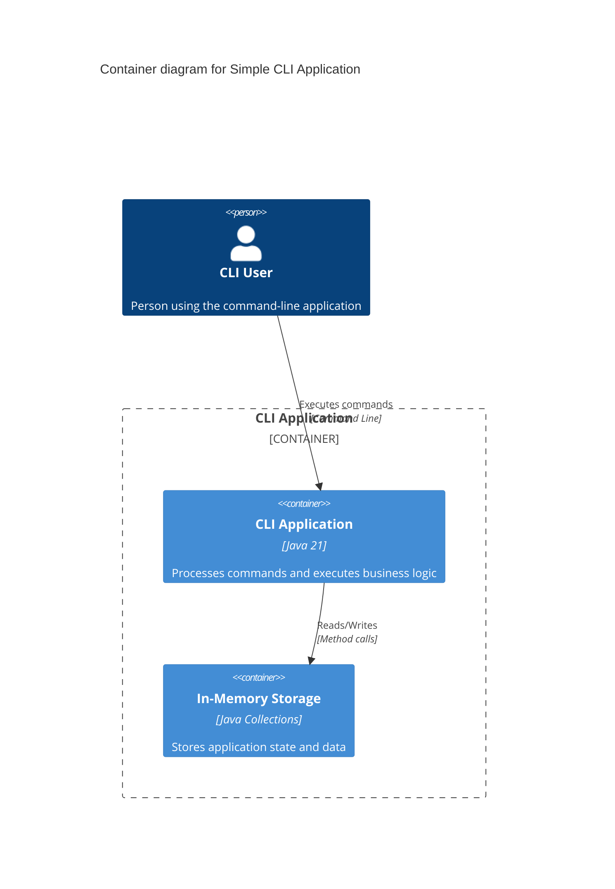

# Systems Architecture for Simple CLI Application

## Overview

**Simple CLI Application** follows a **command-driven architecture**, designed for **command parsing and execution** with **minimal dependencies**.

## Application Tier

### A1: CLI Application Service

**Purpose:** Command-line interface providing argument parsing and command execution

**Technology Stack:**

- **Architecture Style**: Command-driven with screaming architecture
- **Integration Type:** Standard input/output with command parsing
- **Language**: Java 21
- **Framework**: Pure Java (no external frameworks)
- **Key Libraries**: None (standard JDK only)
- **Other Packages**: None required

**Responsibilities:**

- Parse command-line arguments and flags
- Route commands to appropriate handlers
- Execute business logic based on parsed commands
- Provide formatted output and error handling
- Validate command syntax and arguments

**Project Structure (Screaming Architecture):**
```
src/main/java/com/example/cli/
├── hello/                      # Hello Command Feature
│   ├── HelloCommand.java     # Command handler for hello operations
│   ├── HelloService.java     # Business logic for hello feature
│   └── HelloValidator.java   # Input validation for hello commands
├── calc/                       # Calculator Command Feature
│   ├── CalcCommand.java      # Command handler for calculations
│   ├── CalcService.java      # Mathematical operations logic
│   └── CalcValidator.java    # Input validation for calculations
├── user/                       # User Management Feature
│   ├── UserCommand.java      # Command handler for user operations
│   ├── UserService.java      # User management business logic
│   ├── User.java             # User entity model
│   └── UserValidator.java    # User input validation
├── shared/                     # Shared Infrastructure
│   ├── command/
│   │   ├── CommandRegistry.java    # Command registration and lookup
│   │   ├── CommandParser.java      # Argument parsing logic
│   │   ├── CommandExecutor.java    # Command execution coordinator
│   │   └── Command.java            # Base command interface
│   ├── validation/
│   │   ├── ArgumentValidator.java  # Common argument validation
│   │   └── ValidationResult.java   # Validation result wrapper
│   ├── output/
│   │   ├── OutputFormatter.java    # Consistent output formatting
│   │   └── ErrorFormatter.java     # Error message formatting
│   └── exception/
│       ├── CliException.java       # Base CLI exception
│       ├── CommandNotFoundException.java
│       └── InvalidArgumentException.java
└── CliApplication.java        # Main application entry point
```

**Feature Module Architecture:**
Each feature module contains:
- **Command**: Command handler implementing the Command interface
- **Service**: Business logic implementation for the feature
- **Entity**: Domain model (if needed)
- **Validator**: Feature-specific input validation

## Data Tier

### D1: In-Memory Storage

**Storage Type:** In-memory data structures (Maps, Lists)
**Technology:** Java Collections Framework

**Responsibilities:**

- Store application state during execution
- Maintain command history and context
- Provide fast data access for operations
- Handle temporary data processing

**Data Structure:**
```
Memory Storage:
├── Command Registry (Map<String, Command>)
├── Execution Context (Map<String, Object>)
├── User Data (List<User>)
├── Command History (List<String>)
└── Application State (Map<String, String>)
```

## Essential Dependencies (pom.xml)

```xml
<properties>
    <maven.compiler.source>21</maven.compiler.source>
    <maven.compiler.target>21</maven.compiler.target>
    <project.build.sourceEncoding>UTF-8</project.build.sourceEncoding>
</properties>

<build>
    <plugins>
        <plugin>
            <groupId>org.apache.maven.plugins</groupId>
            <artifactId>maven-compiler-plugin</artifactId>
            <version>3.11.0</version>
            <configuration>
                <source>21</source>
                <target>21</target>
                <compilerArgs>
                    <arg>--enable-preview</arg>
                </compilerArgs>
            </configuration>
        </plugin>
    </plugins>
</build>
```

## Core Implementation Patterns

### Main Application (CliApplication.java)
```java
public class CliApplication {
    private final CommandExecutor commandExecutor;
    private final OutputFormatter outputFormatter;
    
    public CliApplication() {
        CommandRegistry registry = new CommandRegistry();
        registerCommands(registry);
        
        CommandParser parser = new CommandParser();
        this.outputFormatter = new OutputFormatter();
        this.commandExecutor = new CommandExecutor(registry, parser, outputFormatter);
    }
    
    public static void main(String[] args) {
        CliApplication app = new CliApplication();
        app.run(args);
    }
    
    public void run(String[] args) {
        if (args.length == 0) {
            outputFormatter.printHelp();
            return;
        }
        
        try {
            commandExecutor.execute(args);
        } catch (CliException e) {
            outputFormatter.printError(e.getMessage());
            System.exit(1);
        }
    }
    
    private void registerCommands(CommandRegistry registry) {
        registry.register("hello", new HelloCommand());
        registry.register("calc", new CalcCommand());
        registry.register("user", new UserCommand());
    }
}
```

### Command Interface (shared/command/Command.java)
```java
public interface Command {
    void execute(String[] args);
    String getDescription();
    String getUsage();
    
    default void validateArgs(String[] args) {
        // Default validation - can be overridden
    }
}
```

### Command Parser (shared/command/CommandParser.java)
```java
public class CommandParser {
    
    public ParsedCommand parse(String[] args) {
        if (args.length == 0) {
            throw new InvalidArgumentException("No command provided");
        }
        
        String commandName = args[0];
        String[] commandArgs = Arrays.copyOfRange(args, 1, args.length);
        
        Map<String, String> flags = new HashMap<>();
        List<String> parameters = new ArrayList<>();
        
        for (int i = 0; i < commandArgs.length; i++) {
            String arg = commandArgs[i];
            
            if (arg.startsWith("--")) {
                // Long flag: --flag=value or --flag value
                handleLongFlag(arg, commandArgs, i, flags);
            } else if (arg.startsWith("-")) {
                // Short flag: -f value
                handleShortFlag(arg, commandArgs, i, flags);
            } else {
                // Regular parameter
                parameters.add(arg);
            }
        }
        
        return new ParsedCommand(commandName, parameters, flags);
    }
    
    private void handleLongFlag(String arg, String[] args, int index, Map<String, String> flags) {
        if (arg.contains("=")) {
            String[] parts = arg.split("=", 2);
            flags.put(parts[0].substring(2), parts[1]);
        } else {
            String flagName = arg.substring(2);
            String value = "true";
            if (index + 1 < args.length && !args[index + 1].startsWith("-")) {
                value = args[index + 1];
            }
            flags.put(flagName, value);
        }
    }
    
    private void handleShortFlag(String arg, String[] args, int index, Map<String, String> flags) {
        String flagName = arg.substring(1);
        String value = "true";
        if (index + 1 < args.length && !args[index + 1].startsWith("-")) {
            value = args[index + 1];
        }
        flags.put(flagName, value);
    }
    
    public record ParsedCommand(String commandName, List<String> parameters, Map<String, String> flags) {}
}
```

### Command Executor (shared/command/CommandExecutor.java)
```java
public class CommandExecutor {
    private final CommandRegistry registry;
    private final CommandParser parser;
    private final OutputFormatter outputFormatter;
    
    public CommandExecutor(CommandRegistry registry, CommandParser parser, OutputFormatter outputFormatter) {
        this.registry = registry;
        this.parser = parser;
        this.outputFormatter = outputFormatter;
    }
    
    public void execute(String[] args) {
        try {
            CommandParser.ParsedCommand parsed = parser.parse(args);
            Command command = registry.getCommand(parsed.commandName());
            
            if (command == null) {
                throw new CommandNotFoundException("Unknown command: " + parsed.commandName());
            }
            
            // Convert back to args array for command execution
            String[] commandArgs = buildCommandArgs(parsed);
            command.execute(commandArgs);
            
        } catch (Exception e) {
            throw new CliException("Command execution failed: " + e.getMessage(), e);
        }
    }
    
    private String[] buildCommandArgs(CommandParser.ParsedCommand parsed) {
        List<String> args = new ArrayList<>();
        args.addAll(parsed.parameters());
        
        // Add flags back to args
        parsed.flags().forEach((key, value) -> {
            args.add("--" + key);
            if (!"true".equals(value)) {
                args.add(value);
            }
        });
        
        return args.toArray(new String[0]);
    }
}
```

### Hello Command Feature (hello/HelloCommand.java)
```java
public class HelloCommand implements Command {
    private final HelloService helloService;
    private final HelloValidator validator;
    private final OutputFormatter outputFormatter;
    
    public HelloCommand() {
        this.helloService = new HelloService();
        this.validator = new HelloValidator();
        this.outputFormatter = new OutputFormatter();
    }
    
    @Override
    public void execute(String[] args) {
        try {
            validator.validate(args);
            
            String name = args.length > 0 ? args[0] : "World";
            boolean uppercase = hasFlag(args, "--upper") || hasFlag(args, "-u");
            
            String greeting = helloService.generateGreeting(name, uppercase);
            outputFormatter.printSuccess(greeting);
            
        } catch (Exception e) {
            outputFormatter.printError("Hello command failed: " + e.getMessage());
        }
    }
    
    @Override
    public String getDescription() {
        return "Greets the user with a hello message";
    }
    
    @Override
    public String getUsage() {
        return "hello [name] [--upper|-u]";
    }
    
    private boolean hasFlag(String[] args, String flag) {
        return Arrays.asList(args).contains(flag);
    }
}
```

### Hello Service (hello/HelloService.java)
```java
public class HelloService {
    
    public String generateGreeting(String name, boolean uppercase) {
        if (name == null || name.trim().isEmpty()) {
            name = "World";
        }
        
        String greeting = "Hello, " + name.trim() + "!";
        
        return uppercase ? greeting.toUpperCase() : greeting;
    }
    
    public String generateCustomGreeting(String name, String greeting, boolean uppercase) {
        if (greeting == null || greeting.trim().isEmpty()) {
            greeting = "Hello";
        }
        
        if (name == null || name.trim().isEmpty()) {
            name = "World";
        }
        
        String message = greeting.trim() + ", " + name.trim() + "!";
        
        return uppercase ? message.toUpperCase() : message;
    }
}
```

### Calculator Command Feature (calc/CalcCommand.java)
```java
public class CalcCommand implements Command {
    private final CalcService calcService;
    private final CalcValidator validator;
    private final OutputFormatter outputFormatter;
    
    public CalcCommand() {
        this.calcService = new CalcService();
        this.validator = new CalcValidator();
        this.outputFormatter = new OutputFormatter();
    }
    
    @Override
    public void execute(String[] args) {
        try {
            validator.validate(args);
            
            if (args.length < 3) {
                throw new InvalidArgumentException("Calculator requires: <number1> <operator> <number2>");
            }
            
            double num1 = Double.parseDouble(args[0]);
            String operator = args[1];
            double num2 = Double.parseDouble(args[2]);
            
            double result = calcService.calculate(num1, operator, num2);
            
            outputFormatter.printSuccess(String.format("%.2f %s %.2f = %.2f", num1, operator, num2, result));
            
        } catch (NumberFormatException e) {
            outputFormatter.printError("Invalid number format");
        } catch (Exception e) {
            outputFormatter.printError("Calculation failed: " + e.getMessage());
        }
    }
    
    @Override
    public String getDescription() {
        return "Performs basic arithmetic operations";
    }
    
    @Override
    public String getUsage() {
        return "calc <number1> <operator> <number2>";
    }
}
```

### Calculator Service (calc/CalcService.java)
```java
public class CalcService {
    
    public double calculate(double num1, String operator, double num2) {
        return switch (operator) {
            case "+", "add" -> num1 + num2;
            case "-", "sub" -> num1 - num2;
            case "*", "mul" -> num1 * num2;
            case "/", "div" -> {
                if (num2 == 0) {
                    throw new IllegalArgumentException("Division by zero");
                }
                yield num1 / num2;
            }
            case "^", "pow" -> Math.pow(num1, num2);
            default -> throw new IllegalArgumentException("Unsupported operator: " + operator);
        };
    }
    
    public double calculateAdvanced(String expression) {
        // Advanced expression parsing could be implemented here
        throw new UnsupportedOperationException("Advanced expressions not implemented");
    }
}
```

### Output Formatter (shared/output/OutputFormatter.java)
```java
public class OutputFormatter {
    
    public void printSuccess(String message) {
        System.out.println("✓ " + message);
    }
    
    public void printError(String message) {
        System.err.println("✗ Error: " + message);
    }
    
    public void printInfo(String message) {
        System.out.println("ℹ " + message);
    }
    
    public void printWarning(String message) {
        System.out.println("⚠ Warning: " + message);
    }
    
    public void printHelp() {
        System.out.println("CLI Application - Available Commands:");
        System.out.println();
        System.out.println("  hello [name] [--upper|-u]     - Greet someone");
        System.out.println("  calc <n1> <op> <n2>          - Calculate two numbers");
        System.out.println("  user create <name> <email>   - Create a new user");
        System.out.println("  user list                    - List all users");
        System.out.println();
        System.out.println("Examples:");
        System.out.println("  java -jar cli.jar hello John --upper");
        System.out.println("  java -jar cli.jar calc 10 + 5");
        System.out.println("  java -jar cli.jar user create 'John Doe' john@example.com");
    }
}
```

### Command Registry (shared/command/CommandRegistry.java)
```java
public class CommandRegistry {
    private final Map<String, Command> commands = new HashMap<>();
    
    public void register(String name, Command command) {
        commands.put(name.toLowerCase(), command);
    }
    
    public Command getCommand(String name) {
        return commands.get(name.toLowerCase());
    }
    
    public Set<String> getAvailableCommands() {
        return commands.keySet();
    }
    
    public boolean hasCommand(String name) {
        return commands.containsKey(name.toLowerCase());
    }
}
```

## Systems Architecture Diagram



## Architectural Decisions Record (ADR)

- **Decision 1:** Use pure Java without external frameworks to minimize dependencies and complexity
- **Decision 2:** Implement screaming architecture to organize commands by business features rather than technical layers
- **Decision 3:** Use Java 21 features (switch expressions, records, pattern matching) for cleaner, more expressive code
- **Decision 4:** Store data in-memory using Java Collections for simplicity and fast access
- **Decision 5:** Implement command pattern with registry for extensible command handling
- **Decision 6:** Use interfaces and dependency injection pattern manually (without frameworks) for testability

---

## Decalogue of Java 21 CLI Coding Best Practices

### 1. **Leverage Java 21 Features Effectively**
Use switch expressions for command routing, records for data transfer objects, pattern matching for argument parsing, and text blocks for help messages. Embrace modern Java syntax for cleaner, more readable code.

### 2. **Organize by Command Features (Screaming Architecture)**
Structure packages by command capabilities (hello/, calc/, user/) rather than technical layers. Each command module should contain its complete implementation: command handler, service logic, and validation.

### 3. **Keep Dependencies Minimal**
Use only standard JDK libraries to avoid external dependencies. Implement required functionality manually using built-in Java collections, I/O operations, and string processing capabilities.

### 4. **Design Clean Command Interface**
Create a consistent Command interface that all commands implement. Use clear method signatures for execute(), getDescription(), and getUsage() to maintain uniformity across all commands.

### 5. **Implement Robust Argument Parsing**
Handle various argument formats (flags, parameters, key-value pairs). Support both short (-f) and long (--flag) flag formats. Provide clear error messages for malformed arguments.

### 6. **Validate Input at Command Boundary**
Validate all command arguments before processing. Check for required parameters, validate data types, and ensure business rules. Provide helpful error messages that guide users to correct usage.

### 7. **Use Command Pattern for Extensibility**
Implement command registry system for easy addition of new commands. Separate command parsing from execution. Make the system extensible without modifying existing command handlers.

### 8. **Provide Consistent Output Formatting**
Create unified output formatting for success, error, warning, and info messages. Use consistent symbols and colors. Implement help system with clear usage examples and command descriptions.

### 9. **Write Comprehensive Tests by Command**
Unit test each command independently. Use integration tests for complete command flows. Mock shared infrastructure components. Aim for high coverage on business logic.

### 10. **Handle Errors Gracefully**
Catch and handle exceptions at appropriate levels. Provide user-friendly error messages without exposing technical details. Use proper exit codes (0 for success, non-zero for errors).

