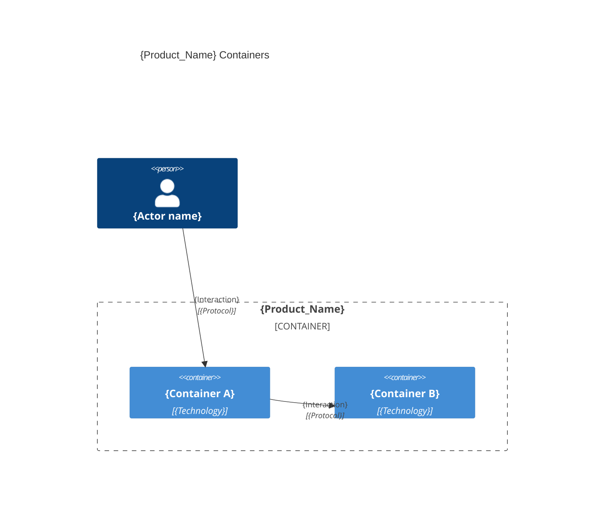

# System Architecture — {Product_Name}

## Overview

{One paragraph: what the system does, key capabilities, and target users.}

---

## Containers

{One `### {Container}` line per container: tier, folder, archetype.}

### {Container name}
- **Tier**: `{back | front | fullstack | e2e | db}` 
- **Folder**: `{folder}/` 
- **Archetype**: {language} / {framework}

---

## Inter-container communication

| Source | Target | Protocol | Contract |
|--------|--------|----------|----------|
| {Container A} | {Container B} | {Protocol} | {Contract summary} |

> last updated: {Date}
