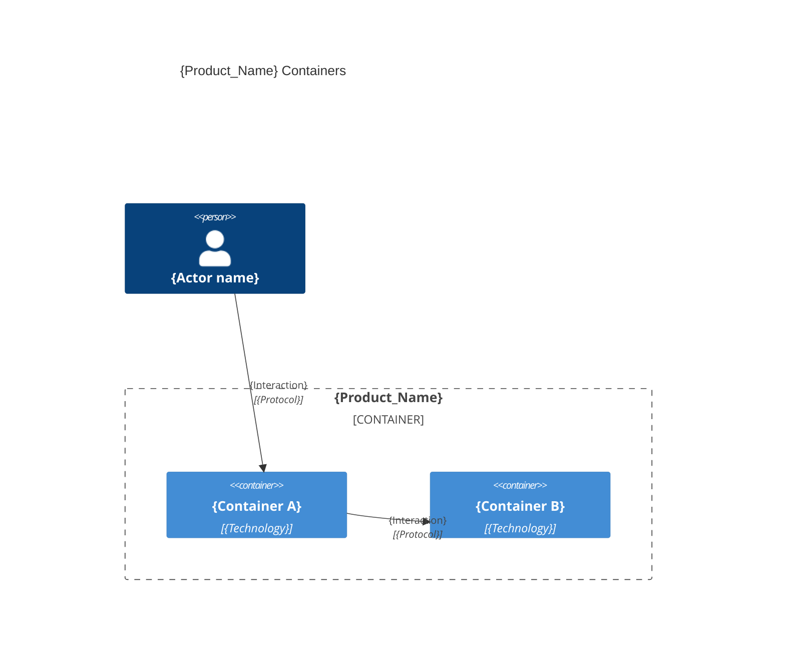
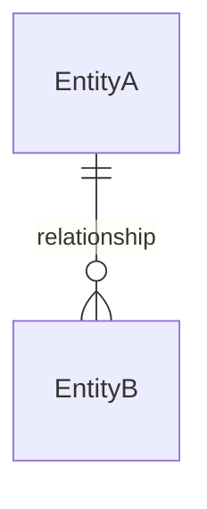

# System architecture — {Product_Name}

## Overview

{One paragraph: what the system does}

---

## Containers diagram

### Containers table
| Container | Technology | Responsibility |
|-----------|------------|----------------|
| [{Container_Name}](./{container_name}.arch.md) | {Technology} | {Responsibility} |

<example>
| Container | Technology | Responsibility |
|-----------|------------|----------------|
| [db](./db.arch.md) | PostgreSQL | Database |
| [api](./api.arch.md) | Java Spring Boot | API |
| [web](./web.arch.md) | React | Web application |
| [mobile](./mobile.arch.md) | React Native | Mobile application |
| [desktop](./desktop.arch.md) | Electron | Desktop application |
| [cli](./cli.arch.md) | CLI | Command line interface |
| [e2e](./e2e.arch.md) | Playwright | End-to-end tests |
</example>

---

## Entity-Relationship diagram

> Canonical, system-wide entity model. Specs reference a feature subset; container docs add physical schemas.

{Only entities and relationships; no attributes nor constraints.}

---

> last updated: {Date}

