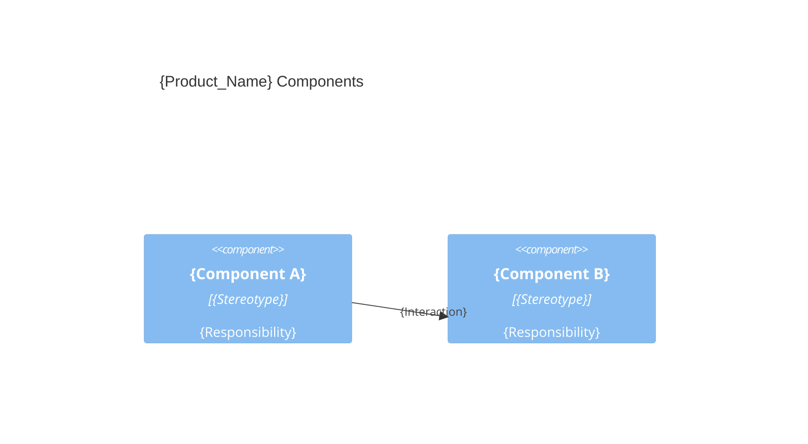
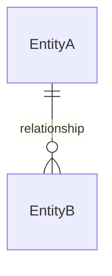

# Components & Domain — {Product_Name}

## Overview

{One paragraph: how the codebase is organized and the main technology.}

---

## Components



### Code organization

**Pattern**: {Layer-based | Feature-based | Hybrid}.

```text
{source_root}/
├── {folder_or_file}    # {one-line responsibility}
└── {folder_or_file}    # {one-line responsibility}
```

### Key contracts

{API routes, interfaces, or models exposed across the code. Use a short table.}

| Contract | Shape | Used by |
|----------|-------|---------|
| {name} | {signature / route / schema} | {consumer} |

---

## Domain entities

{Entities and key fields folded in here — no separate ER file.}



### {Entity_Name}

| Field | Type | Constraints |
|-------|------|-------------|
| `{field}` | {Type} | {PK, FK → Target, unique, required, ...} |

**Rules**: {key integrity / business rules to enforce during `/codify`.}

> last updated: {Date}
