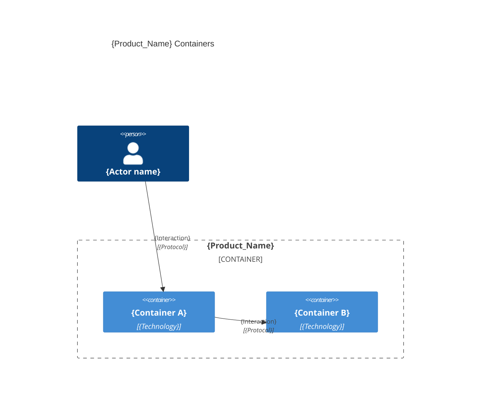
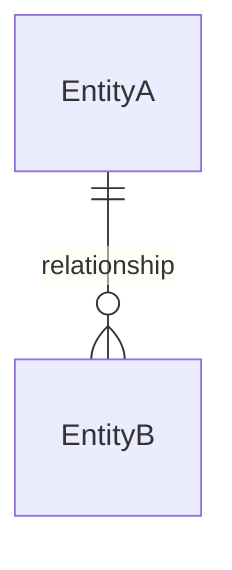

# Architecture — {Product_Name}

## Overview

{One paragraph: what the system does}

---

## Containers diagram



## Container 1
- **Tier**: `{back | front | fullstack | e2e | db}`
- **Folder**: `{folder}/`
- **Archetype**: {language} — {framework}

### Development workflow scripts

```bash
{scripts to call for compiling, running, testing the container}
```

### Code organization

**Pattern**: {Layer-based | Feature-based | Hybrid}.

```text
{source_root}/
├── {folder_or_file}    # {one-line responsibility}
└── {folder_or_file}    # {one-line responsibility}
```

### Code rules
> Only the few rules that genuinely change how code is written here. Skip generic advice.

- **Naming**: {casing for files, types, functions — one line, e.g. `kebab-case files, PascalCase types`.}
- **Structure**: {dominant pattern — layer-based | feature-based; one line.}
- **Errors**: {dominant error-handling rule.}
- **Testing**: {placement + naming, e.g. colocated `*.spec.ts`.}
- **Avoid**: {1–3 concrete anti-patterns, each with a one-clause reason.}

---

## Entity-Relationship diagram



---


> last updated: {Date}

